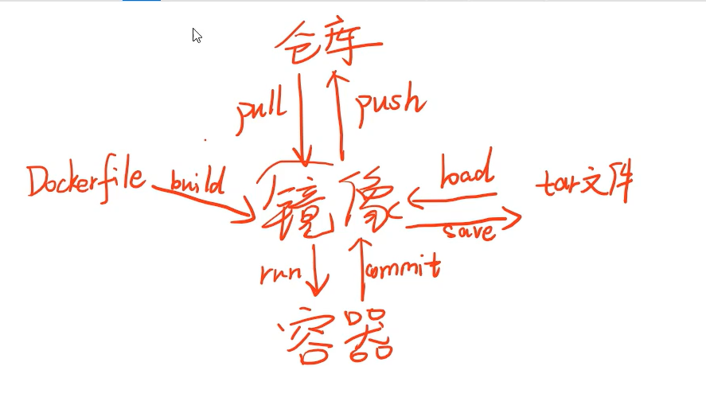

* 安装和常用CLI：
  * 添加阿里云镜像：sudo yum-config-manager --add-repo https://mirrors.aliyun.com/docker-ce/linux/centos/docker-ce.repo
  * 安装命令：sudo yum install -y docker-ce docker-ce-cli containerd.io
  * 启动命令：sudo systemctl start docker
  * 添加当前用户到docker用户组：sudo usermod -aG docker $USER （需注销），newgrp docker （立即生效）

* 先去注册docker hub账号密码，然后命令行docker login，docker push之前先打标签：docker tag：标记本地镜像，将其归入某一仓库，语法：docker tag [OPTIONS] 镜像id或者镜像名加tag名 dockerhub用户名/仓库名:tag名
* Helloworld：docker run hello-world （本地没有镜像的话会自动从远端仓库pull）
* pull nginx 镜像：docker pull nginx（等效于nginx:latest）
* 运行：docker run -【d】（后台运行不阻塞shell） 【-p 80:80】（指定容器端口映射，外部：内部）-v(容器外目录:容器内目录) -e(环境变量key:环境变量value) --rm:用完即删
--name:指定名字 nginx
* 查看正在运行：docker ps
* 查看内容：docker inspect <容器id>
* 删除容器：docker rm -f container id(不用打全，前缀区分)
* 进入bash：docker exec -it container id(不用打全，前缀区分) bash
* commit镜像：docker commit container id(不用打全，前缀区分) name
* 查看镜像列表：docker images （刚才commit的镜像）
* 使用运行刚才commit的镜像：docker run -d name
* 使用Dockerfile构建镜像：docker build -t name 存放Dockerfile的文件夹
* 删除镜像：docker rmi name
* 保存为tar：docker save name >> tar name
* 从tar加载：docker load << tar name
* 一些启动参数：
  * 后台运行容器：-d
  * 容器内外端口映射：-p 主机端口号:容器端口号
  * 目录映射：-v dir name : dir
  * 指定映像版本：name:ver
* Docker容器互相连接
  * Docker Networking
  * Docker链接
  * Docker Compose
* Docker4组核心的Dockerfile指令
  * USER/WORKDIR指令
  * ADD/EXPOSE指令
  * RUN/ENV指令
  * CMD/ENTRYPOINT指令
  ```Dockerfile
  FROM 909336740/nginx:v1.12.2
  USER root
  ENV WWW /usr/share/nginx/html
  ENV CONF /etc/nginx/conf.d
  RUN /bin/cp /usr/share/zoneinfo/Asia/Shanghai /etc/localtime && echo 'Asia/Shanghai' >/etc/timezone
  WORKDIR $WWW
  ADD index.html $WWW/index.html
  ADD demo.od.com.conf $CONF/demo.od.com.conf
  EXPOSE 80
  CMD ["nginx","-g","daemon off;"]

  FROM：从哪里导入
  USER：用什么用户起
  ENV：设置环境变量
  RUN： 修改时区成中国时区'Asia/Shanghai'
  WORKDIR：指定工作目录，这里指定的是之前ENV指定的WWW 目录，即是/usr/share/nginx/html
  ADD：添加指定的东西进去
  EXPOSE：暴露端口
  CMD：指令的首要目的在于为启动的容器指定默认要运行的程序，程序运行结束，容器也就结束
  ```
  * dockerfile四种网络类型
    * Bridge contauner（NAT） 桥接式网络模式(默认)
    * None(Close) container 封闭式网络模式，不为容器配置网络
    * Host(open) container 开放式网络模式，和宿主机共享网络
    * Container(join) container 联合挂载式网络模式，和其他容器共享网络

* Docker Image可以理解成多个只读文件叠加而成，因此Docker Image是只读的。当我们将其运行起来，就相当于在只读的Image外包裹了一层读写层变成了容器。当你删除容器之后，使用这个镜像重新创建一个容器，此时的镜像的只读层还和原来的一样，但是你在读写层的修改全部都会丢失。docker使用volume实现数据的持久化，不仅如此volume还能帮助容器和容器之间，容器和host之间共享数据。
