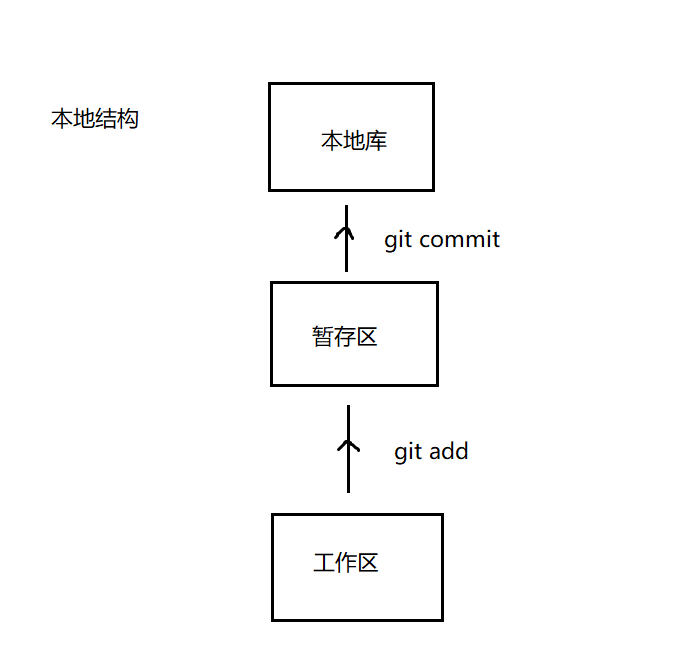
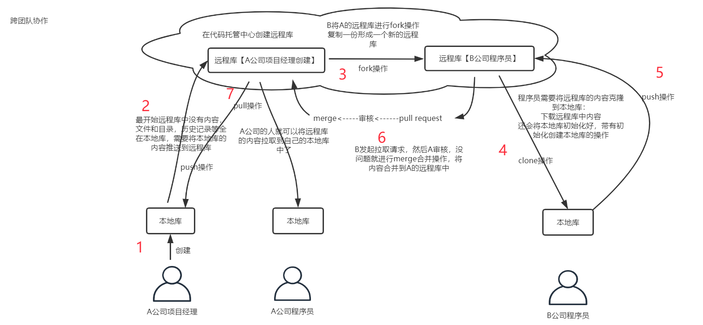
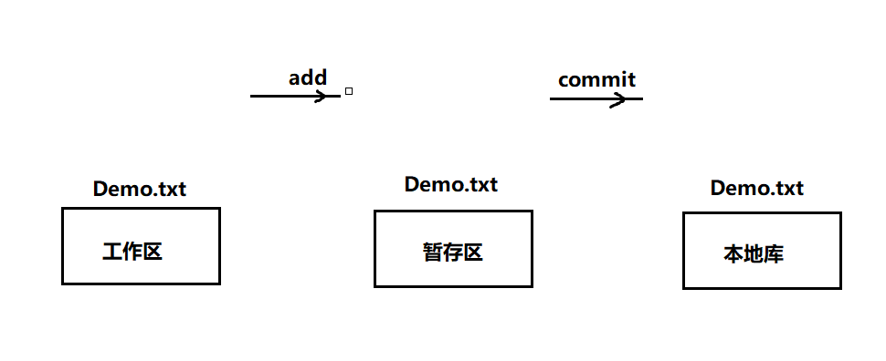
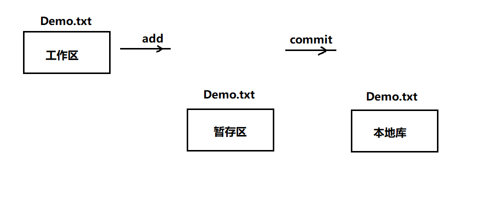
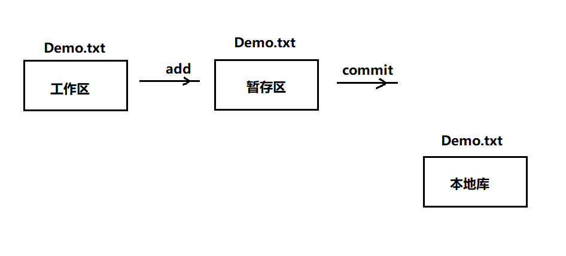

  

* 创建本地账号密码：
  * git config --global user.name yourname
  * git config --global user.email [yourname@momenta.ai](mailto:yourname@momenta.ai)

* 克隆到本地并且拉取代码
  1. git clone默认master分支，git clone -b QAT/dev克隆指定分支，克隆操作可以帮我们完成：初始化本地库；将远程库内容完整的克隆到本地；替我们创建远程库的别名
  2. 拉下来代码，首先切换到自己分支，没有自己分支可以用git小乌龟或git命令创建，git checkout -b tl/dev/compile origin/QAT/dev（也可以git branch tl/dev，直接生成现在指针对应分支的复制），最好一个功能一个分支，否则容易出错
  3. 若是旧代码，运行前先拉取下远端分支最新的，git stash；git pull --rebase origin QAT/dev；git stash pop,这样就跟新了最新的代码，拉取操作 pull操作，相当于fetch+merge。在抓取操作（fetch）执行后，只是将远程库的内容下载到本地，但是工作区中的文件并没有更新。工作区中还是原先的内容 

* 提交代码：
  * 假如目前在 QAT/hhm/feature1 分支上
    * git add xxx
    * git commit -m "feat: 增加版本管理"  # 先提交修改
    * git checkout QAT/dev
    * git pull  更新一下本地的 QAT/dev
    * git checkout QAT/hhm/feature1
    * git rebase -i QAT/dev         -i显示交互式界面，在交互式界面里选 commit，pick 或 p 是选中，squash 或 s 是压缩入上个提交；在交互式界面里编辑 commit 信息，看保留哪一个
    * git push origin QAT/hhm/feature1（不要 git push 到 QAT/dev  QAT/prod master 什么的，只能 push 到你自己的分支，请务必注意）
    * 合入测试分支；在 devops 网页上提交一个 pull request，从 QAT/hhm/feature1 合到 QAT/dev；仔细检查 commit 和 files 有没有问题；前后端分别找人 review；review 时如果有问题，本地修改，commit，rebase，git push -f；review 到没有问题，合入代码

* 查看仓库别名：git remote -v
* 起别名：git remote add 别名 仓库链接

* git status看的是工作区和暂存区的状态

* 当你在git分支中改代码时，接到任务需要修复一个bug，你需要在当前分支外新建一个分支来处理bug，当然不能把你刚才写的代码带到那个分支，因为你做的新功能还没测，更不能提交。所以你需要git stash命令暂存修改

* git stash 暂存：stash是临时保存文件修改内容的区域。stash可以暂时保存工作树和索引里还没提交的修改内容，您可以事后再取出暂存的修改，应用到原先的分支或其他的分支上，后面可加save+具体文件来存某一个，也可以git stash save "备注"，

* git stash pop 恢复暂存

* 你如果git stash暂存了很多次，你需要指定pop版本，可以使用git stash apply stash@{1}）。其中stash@{1}是啥？你可通过git stash list查看到stash@{1}是你stash内容的版本

* 这边需要说明一下，并不是每次git stash都要先git add .的。当你的修改的都是原有文件，那是不需要在git stash之前进行git add 操作的，但是如果你所作的修改涉及到了本次才新建的文件，那么此时git stash之前是要做git add .的。因为新建的文件还没有进入版本控制库，需要add操作才能将新建的文件添加进库。如果在你新建之后直接git stash，未作git add .操作。那么新建文件将仍然保留在工作区，进栈内容不包含新建的文件。

* 多人协作解决冲突
  * 查看分支：git branch（看详细的后面可以加个-v）
  * 切换分支：git checkout tl/dev
  * 在不同的分支解决冲突，然后push时，push的是相应的分支，别想着在当前分支push别的
  * 合并分支：git merge QAT/dev
  * Merge冲突之后代码里会出现相应的东西，<<<<<<<，=======，>>>>>>>标记出不同分支的内容，自己修改删除相应的代码后再add和commit，最后再push

* git log 可以让我们查看提交的，显示从最近到最远的日志
  * 下一页：空格
  * 上一页： b
  * 到尾页了 ，显示END
  * 退出：q

* 日志展示方式：
  * 方式1：git log 
  * 方式2：git log --pretty=onelint
  * 方式3：git --oneline
  * 方式4：git reflog，多了信息：HEAD@{数字}，这个数字的含义：指针回到当前这个历史版本需要走多少步

* reset命令：前进或者后退历史版本
  * hard参数：git reset --hard [索引]（索引就是前面git reflog后HEAD后面的数字）本地库的指针移动的同时，重置暂存区，重置工作区
  * mixed参数：本地库的指针移动的同时，重置暂存区，但是工作区不动
  * soft参数：本地库的指针移动的时候，暂存区，工作区都不动

* git diff [文件名]   ---》   将工作区中的文件和暂存区中文件进行比较
  git diff --->比较工作区中和暂存区中 所有文件的差异
  git diff [历史版本][文件名]   ---》比较暂存区和工作区中内容

* 要把两个不同的项目合并，git需要添加一句代码，在git pull之后， 添加--allow-unrelated-histories  告诉 git 允许不相关历史合并。假如我们的源是origin，分支是master，那么我们需要这样写 git pull origin master --allow-unrelated-histories  这个方法只解决因为两个仓库有不同的开始点，也就是两个仓库没有共同的 commit 出现的无法提交。如果还无法提交，需要看一下是不是发生了冲突，解决冲突再提交

* git提交规范：其中，Header 是必需的，Body 和 Footer 可以省略。
> <type>(<scope>): <subject>
> // 空一行
> <body>
> // 空一行
> <footer>
> 
> type用于说明 commit 的类别，只允许使用下面7个标识。
> > feat：新功能（feature）
> > fix：修补bug
> > docs：文档（documentation）
> > style： 格式（不影响代码运行的变动）
> > refactor：重构（即不是新增功能，也不是修改bug的代码变动）
> > test：增加测试
> > chore：构建过程或辅助工具的变动
> 
> scope用于说明 commit 影响的范围，比如数据层、控制层、视图层等等，视项目不同而不同。
> 
> subject是 commit 目的的简短描述，不超过50个字符。
> 
> Body 部分是对本次 commit 的详细描述，可以分成多行。
> 
> Footer 部分只用于两种情况。
> > 不兼容变动：如果当前代码与上一个版本不兼容，则 Footer 部分以BREAKING CHANGE开头，后面是对变动的描述、以及变动理由和迁移方法。
> > 关闭 Issue：如果当前 commit 针对某个issue，那么可以在 Footer 部分关闭这个 issue，也可以一次关闭多个 issue
> 
> 还有一种特殊情况，如果当前 commit 用于撤销以前的 commit，则必须以revert:开头，后面跟着被撤销 Commit 的 Header。
```
