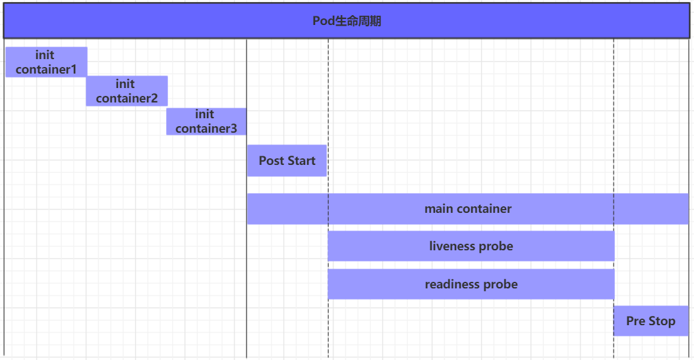
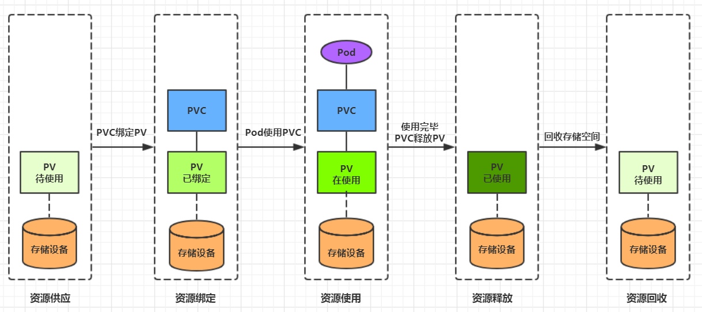

# kubernetes组件


* master：集群的控制平面，负责集群的决策 ( 管理 )

  ApiServer : 资源操作的唯一入口，接收用户输入的命令，提供认证、授权、API注册和发现等机制

  Scheduler : 负责集群资源调度，按照预定的调度策略将Pod调度到相应的node节点上

  ControllerManager : 负责维护集群的状态，比如程序部署安排、故障检测、自动扩展、滚动更新等

  Etcd ：负责存储集群中各种资源对象的信息

* node：集群的数据平面，负责为容器提供运行环境 ( 干活 )

  Kubelet : 负责维护容器的生命周期，即通过控制docker，来创建、更新、销毁容器

  KubeProxy : 负责提供集群内部的服务发现和负载均衡

  Docker : 负责节点上容器的各种操作

> Master：集群控制节点，每个集群需要至少一个master节点负责集群的管控
>
> Node：工作负载节点，由master分配容器到这些node工作节点上，然后node节点上的docker负责容器的运行
>
> Pod：kubernetes的最小控制单元，容器都是运行在pod中的，一个pod中可以有1个或者多个容器
>
> Controller：控制器，通过它来实现对pod的管理，比如启动pod、停止pod、伸缩pod的数量等等
>
> Service：pod对外服务的统一入口，下面可以维护者同一类的多个pod
>
> Label：标签，用于对pod进行分类，同一类pod会拥有相同的标签
>
> NameSpace：命名空间，用来隔离pod的运行环境

# kubernetes集群环境搭建

目前生产部署Kubernetes 集群主要有两种方式：

* kubeadm

  Kubeadm 是一个K8s 部署工具，提供kubeadm init 和kubeadm join，用于快速部署Kubernetes 集群。

* 二进制包

  从github 下载发行版的二进制包，手动部署每个组件，组成Kubernetes 集群。

Kubeadm 降低部署门槛，但屏蔽了很多细节，遇到问题很难排查。如果想更容易可控，推荐使用二进制包部署Kubernetes 集群，虽然手动部署麻烦点，期间可以学习很多工作原理，也利于后期维护。

## kubeadm 部署


   > 最终目标
   > 
   > 在所有节点上安装Docker 和kubeadm
   > 部署Kubernetes Master
   > 部署容器网络插件
   > 部署Kubernetes Node，将节点加入Kubernetes 集群中
   > 部署Dashboard Web 页面，可视化查看Kubernetes 资源

kubeadm 是官方社区推出的一个用于快速部署kubernetes 集群的工具，这个工具能通过两条指令完成一个kubernetes 集群的部署：

1. 创建一个Master节点kubeadm init

   > 在开始之前，部署Kubernetes 集群机器需要满足以下几个条件：
   >
   > 一台或多台机器，操作系统CentOS7.x-86_x64
   >
   > | 角色     | IP地址         | 组件                              |
   > | -------- | -------------- | --------------------------------- |
   > | master01 | 192.168.90.100 | docker，kubectl，kubeadm，kubelet |
   > | node01   | 192.168.90.106 | docker，kubectl，kubeadm，kubelet |
   > | node02   | 192.168.90.107 | docker，kubectl，kubeadm，kubelet |
   >
   > 集群中所有机器之间网络互通
   >
   > ```bash
   > # 此方式下安装kubernetes集群要求Centos版本要在7.5或之上
   > [root@master ~]# cat /etc/redhat-release
   > Centos Linux 7.5.1804 (Core)
   > 
   > # 主机名成解析 编辑三台服务器的/etc/hosts文件，添加下面内容
   > 192.168.90.100 master
   > 192.168.90.106 node1
   > 192.168.90.107 node2
   > 
   > # kubernetes要求集群中的节点时间必须精确一直，这里使用chronyd服务从网络同步时间 企业中建议配置内部的会见同步服务器
   > [root@master ~]# systemctl start chronyd
   > [root@master ~]# systemctl enable chronyd
   > [root@master ~]# date
   > 
   > # 禁用iptable和firewalld服务 kubernetes和docker 在运行的中会产生大量的iptables规则，为了不让系统规则跟它们混淆，直接关闭系统的规则
   > # 1 关闭firewalld服务
   > [root@master ~]# systemctl stop firewalld
   > [root@master ~]# systemctl disable firewalld
   > # 2 关闭iptables服务
   > [root@master ~]# systemctl stop iptables
   > [root@master ~]# systemctl disable iptables
   > 
   > # 禁用selinux selinux是linux系统下的一个安全服务，如果不关闭它，在安装集群中会产生各种各样的奇葩问题
   > # 编辑 /etc/selinux/config 文件，修改SELINUX的值为disable
   > # 注意修改完毕之后需要重启linux服务
   > SELINUX=disabled
   > ```
   >
   > 可以访问外网，需要拉取镜像
   > 禁止swap 分区
   >
   > ```bash
   > # swap分区指的是虚拟内存分区，它的作用是物理内存使用完，之后将磁盘空间虚拟成内存来使用，启用swap设备会对系统的性能产生非常负面的影响，因此kubernetes要求每个节点都要禁用swap设备，但是如果因为某些原因确实不能关闭swap分区，就需要在集群安装过程中通过明确的参数进行配置说明
   > # 编辑分区配置文件/etc/fstab，注释掉swap分区一行
   > # 注意修改完毕之后需要重启linux服务
   > vim /etc/fstab
   > 注释掉 /dev/mapper/centos-swap swap
   > # /dev/mapper/centos-swap swap
   > 
   > # 修改linux的内核参数
   > # 修改linux的内核采纳数，添加网桥过滤和地址转发功能
   > # 编辑/etc/sysctl.d/kubernetes.conf文件，添加如下配置：
   > net.bridge.bridge-nf-call-ip6tables = 1
   > net.bridge.bridge-nf-call-iptables = 1
   > net.ipv4.ip_forward = 1
   > # 重新加载配置
   > [root@master ~]# sysctl -p
   > # 加载网桥过滤模块
   > [root@master ~]# modprobe br_netfilter
   > # 查看网桥过滤模块是否加载成功
   > [root@master ~]# lsmod | grep br_netfilter
   > 
   > # 配置ipvs功能 在Kubernetes中Service有两种带来模型，一种是基于iptables的，一种是基于ipvs的两者比较的话，ipvs的性能明显要高一些，但是如果要使用它，需要手动载入ipvs模块
   > # 1.安装ipset和ipvsadm
   > [root@master ~]# yum install ipset ipvsadm -y
   > # 2.添加需要加载的模块写入脚本文件
   > [root@master ~]# cat <<EOF> /etc/sysconfig/modules/ipvs.modules
   > #!/bin/bash
   > modprobe -- ip_vs
   > modprobe -- ip_vs_rr
   > modprobe -- ip_vs_wrr
   > modprobe -- ip_vs_sh
   > modprobe -- nf_conntrack_ipv4
   > EOF
   > # 3.为脚本添加执行权限
   > [root@master ~]# chmod +x /etc/sysconfig/modules/ipvs.modules
   > # 4.执行脚本文件
   > [root@master ~]# /bin/bash /etc/sysconfig/modules/ipvs.modules
   > # 5.查看对应的模块是否加载成功
   > [root@master ~]# lsmod | grep -e ip_vs -e nf_conntrack_ipv4
   > ```
   
   * 安装docker
   
     ```bash
     # 1、切换镜像源
     [root@master ~]# wget https://mirrors.aliyun.com/docker-ce/linux/centos/docker-ce.repo -O /etc/yum.repos.d/docker-ce.repo
     
     # 2、查看当前镜像源中支持的docker版本
     [root@master ~]# yum list docker-ce --showduplicates
     
     # 3、安装特定版本的docker-ce
     # 必须制定--setopt=obsoletes=0，否则yum会自动安装更高版本
     [root@master ~]# yum install --setopt=obsoletes=0 docker-ce-18.06.3.ce-3.el7 -y
     
     # 4、添加一个配置文件
     #Docker 在默认情况下使用Vgroup Driver为cgroupfs，而Kubernetes推荐使用systemd来替代cgroupfs
     [root@master ~]# mkdir /etc/docker
     [root@master ~]# cat <<EOF> /etc/docker/daemon.json
     {
     	"exec-opts": ["native.cgroupdriver=systemd"],
     	"registry-mirrors": ["https://kn0t2bca.mirror.aliyuncs.com"]
     }
     EOF
     
     # 5、启动dokcer
     [root@master ~]# systemctl restart docker
     [root@master ~]# systemctl enable docker
     ```
     
   * 安装Kubernetes组件
   
     ```bash
     # 1、由于kubernetes的镜像在国外，速度比较慢，这里切换成国内的镜像源
     # 2、编辑/etc/yum.repos.d/kubernetes.repo,添加下面的配置
     [kubernetes]
     name=Kubernetes
     baseurl=http://mirrors.aliyun.com/kubernetes/yum/repos/kubernetes-el7-x86_64
     enabled=1
     gpgchech=0
     repo_gpgcheck=0
     gpgkey=http://mirrors.aliyun.com/kubernetes/yum/doc/yum-key.gpg
     			http://mirrors.aliyun.com/kubernetes/yum/doc/rpm-package-key.gpg
     
     # 3、安装kubeadm、kubelet和kubectl
     [root@master ~]# yum install --setopt=obsoletes=0 kubeadm-1.17.4-0 kubelet-1.17.4-0 kubectl-1.17.4-0 -y
     
     # 4、配置kubelet的cgroup
     #编辑/etc/sysconfig/kubelet, 添加下面的配置
     KUBELET_CGROUP_ARGS="--cgroup-driver=systemd"
     KUBE_PROXY_MODE="ipvs"
     
     # 5、设置kubelet开机自启
     [root@master ~]# systemctl enable kubelet
     ```
   
   * 准备集群镜像
   
     ```bash
     # 在安装kubernetes集群之前，必须要提前准备好集群需要的镜像，所需镜像可以通过下面命令查看
     [root@master ~]# kubeadm config images list
     
     # 下载镜像
     # 此镜像kubernetes的仓库中，由于网络原因，无法连接，下面提供了一种替换方案，写一个shell脚本
     images=(
     	kube-apiserver:v1.17.4
     	kube-controller-manager:v1.17.4
     	kube-scheduler:v1.17.4
     	kube-proxy:v1.17.4
     	pause:3.1
     	etcd:3.4.3-0
     	coredns:1.6.5
     )
     
     for imageName in ${images[@]};do
     	docker pull registry.cn-hangzhou.aliyuncs.com/google_containers/$imageName
     	docker tag registry.cn-hangzhou.aliyuncs.com/google_containers/$imageName k8s.gcr.io/$imageName
     	docker rmi registry.cn-hangzhou.aliyuncs.com/google_containers/$imageName 
     done
     ```
   
   
   * 下面的操作只需要在master节点上执行即可
   
     ```bash
     # 创建集群
     [root@master ~]# kubeadm init \
     	--apiserver-advertise-address=192.168.90.100 \
     	--image-repository registry.aliyuncs.com/google_containers \
     	--kubernetes-version=v1.17.4 \
     	--service-cidr=10.96.0.0/12 \
     	--pod-network-cidr=10.244.0.0/16
     # 创建必要文件
     [root@master ~]# mkdir -p $HOME/.kube
     [root@master ~]# sudo cp -i /etc/kubernetes/admin.conf $HOME/.kube/config
     [root@master ~]# sudo chown $(id -u):$(id -g) $HOME/.kube/config
     ```
   
2. 将Node 节点加入到当前集群中$ kubeadm join <Master 节点的IP 和端口>

   * 下面的操作只需要在node节点上执行即可

     ```bash
     # 下面这条命令是在master上出现的
     kubeadm join 192.168.0.100:6443 --token awk15p.t6bamck54w69u4s8 \
         --discovery-token-ca-cert-hash sha256:a94fa09562466d32d29523ab6cff122186f1127599fa4dcd5fa0152694f17117 
     # 生成 新的token
     [root@master ~]# kubeadm token create --print-join-command
     ```

3. 后续操作

   > kubectl可以在node节点上运行吗 ?
   >
   > kubectl的运行是需要进行配置的，它的配置文件是$HOME/.kube，如果想要在node节点运行此命令，需要将master上的.kube文件复制到node节点上，即在master节点上执行下面操作：
   >
   > scp  -r  HOME/.kube   node1: HOME/
   
   * 在master上查看节点信息，后续所有操作都需要看下集群状态
   
     ```bash
     [root@master ~]# kubectl get nodes
     NAME    STATUS   ROLES     AGE   VERSION
     master  NotReady  master   6m    v1.17.4
     node1   NotReady   <none>  22s   v1.17.4
     node2   NotReady   <none>  19s   v1.17.4
     ```

   * 安装网络插件，只在master节点操作即可

     ```bash
     wget https://raw.githubusercontent.com/coreos/flannel/master/Documentation/kube-flannel.yml
     ```
   
   * 使用kubeadm reset重置集群
   
     ```bash
     #在master节点之外的节点进行操作
     kubeadm reset
     systemctl stop kubelet
     systemctl stop docker
     rm -rf /var/lib/cni/
     rm -rf /var/lib/kubelet/*
     rm -rf /etc/cni/
     # 以下可能不需要做，只有docker0
     ifconfig cni0 down
     ifconfig flannel.1 down
     ifconfig docker0 down
     ip link delete cni0
     ip link delete flannel.1
     ##重启kubelet
     systemctl restart kubelet
     ##重启docker
     systemctl restart docker
     ```
   
   * 重启kubelet和docker
   
     ```bash
     # 重启kubelet
     systemctl restart kubelet
     # 重启docker
     systemctl restart docker
     ```
   
   * 使用配置文件启动fannel
   
     ```bash
     kubectl apply -f kube-flannel.yml
     若是集群状态一直是 notready,用下面语句查看原因，
     journalctl -f -u kubelet.service
     若原因是： cni.go:237] Unable to update cni config: no networks found in /etc/cni/net.d
     mkdir -p /etc/cni/net.d #创建目录给flannel做配置文件
     vim /etc/cni/net.d/10-flannel.conf #编写配置文件
     {
      "name":"cbr0",
      "cniVersion":"0.3.1",
      "type":"flannel",
      "deledate":{
         "hairpinMode":true,
         "isDefaultGateway":true
       }
     
     }
     ```
   
   * 集群测试
   
     ```bash
     创建一个nginx服务
     kubectl create deployment nginx  --image=nginx:1.14-alpine
     暴露端口
     kubectl expose deploy nginx  --port=80 --target-port=80  --type=NodePort
     ```
   
   * 测试结果
   
     
   
     

4. DashBoard

   下载yaml，并运行Dashboard

   ```bash
   # 下载yaml
   [root@k8s-master01 ~]# wget  https://raw.githubusercontent.com/kubernetes/dashboard/v2.0.0/aio/deploy/recommended.yaml
   
   # 修改kubernetes-dashboard的Service类型
   kind: Service
   apiVersion: v1
   metadata:
     labels:
       k8s-app: kubernetes-dashboard
     name: kubernetes-dashboard
     namespace: kubernetes-dashboard
   spec:
     type: NodePort  # 新增
     ports:
       - port: 443
         targetPort: 8443
         nodePort: 30009  # 新增
     selector:
       k8s-app: kubernetes-dashboard
   
   # 部署
   [root@k8s-master01 ~]# kubectl create -f recommended.yaml
   
   # 查看namespace下的kubernetes-dashboard下的资源
   [root@k8s-master01 ~]# kubectl get pod,svc -n kubernetes-dashboard
   NAME                                            READY   STATUS    RESTARTS   AGE
   pod/dashboard-metrics-scraper-c79c65bb7-zwfvw   1/1     Running   0          111s
   pod/kubernetes-dashboard-56484d4c5-z95z5        1/1     Running   0          111s
   
   NAME                               TYPE       CLUSTER-IP      EXTERNAL-IP  PORT(S)         AGE
   service/dashboard-metrics-scraper  ClusterIP  10.96.89.218    <none>       8000/TCP        111s
   service/kubernetes-dashboard       NodePort   10.104.178.171  <none>       443:30009/TCP   111s
   ```

   创建访问账户，获取token

   ```yaml
   # 创建账号
   [root@k8s-master01-1 ~]# kubectl create serviceaccount dashboard-admin -n kubernetes-dashboard
   
   # 授权
   [root@k8s-master01-1 ~]# kubectl create clusterrolebinding dashboard-admin-rb --clusterrole=cluster-admin --serviceaccount=kubernetes-dashboard:dashboard-admin
   
   # 获取账号token
   [root@k8s-master01 ~]#  kubectl get secrets -n kubernetes-dashboard | grep dashboard-admin
   dashboard-admin-token-xbqhh        kubernetes.io/service-account-token   3      2m35s
   
   [root@k8s-master01 ~]# kubectl describe secrets dashboard-admin-token-xbqhh -n kubernetes-dashboard
   Name:         dashboard-admin-token-xbqhh
   Namespace:    kubernetes-dashboard
   Labels:       <none>
   Annotations:  kubernetes.io/service-account.name: dashboard-admin
                 kubernetes.io/service-account.uid: 95d84d80-be7a-4d10-a2e0-68f90222d039
   
   Type:  kubernetes.io/service-account-token
   
   Data
   ====
   namespace:  20 bytes
   token:      eyJhbGciOiJSUzI1NiIsImtpZCI6ImJrYkF4bW5XcDhWcmNGUGJtek5NODFuSXl1aWptMmU2M3o4LTY5a2FKS2cifQ.eyJpc3MiOiJrdWJlcm5ldGVzL3NlcnZpY2VhY2NvdW50Iiwia3ViZXJuZXRlcy5pby9zZXJ2aWNlYWNjb3VudC9uYW1lc3BhY2UiOiJrdWJlcm5ldGVzLWRhc2hib2FyZCIsImt1YmVybmV0ZXMuaW8vc2VydmljZWFjY291bnQvc2VjcmV0Lm5hbWUiOiJkYXNoYm9hcmQtYWRtaW4tdG9rZW4teGJxaGgiLCJrdWJlcm5ldGVzLmlvL3NlcnZpY2VhY2NvdW50L3NlcnZpY2UtYWNjb3VudC5uYW1lIjoiZGFzaGJvYXJkLWFkbWluIiwia3ViZXJuZXRlcy5pby9zZXJ2aWNlYWNjb3VudC9zZXJ2aWNlLWFjY291bnQudWlkIjoiOTVkODRkODAtYmU3YS00ZDEwLWEyZTAtNjhmOTAyMjJkMDM5Iiwic3ViIjoic3lzdGVtOnNlcnZpY2VhY2NvdW50Omt1YmVybmV0ZXMtZGFzaGJvYXJkOmRhc2hib2FyZC1hZG1pbiJ9.NAl7e8ZfWWdDoPxkqzJzTB46sK9E8iuJYnUI9vnBaY3Jts7T1g1msjsBnbxzQSYgAG--cV0WYxjndzJY_UWCwaGPrQrt_GunxmOK9AUnzURqm55GR2RXIZtjsWVP2EBatsDgHRmuUbQvTFOvdJB4x3nXcYLN2opAaMqg3rnU2rr-A8zCrIuX_eca12wIp_QiuP3SF-tzpdLpsyRfegTJZl6YnSGyaVkC9id-cxZRb307qdCfXPfCHR_2rt5FVfxARgg_C0e3eFHaaYQO7CitxsnIoIXpOFNAR8aUrmopJyODQIPqBWUehb7FhlU1DCduHnIIXVC_UICZ-MKYewBDLw
   ca.crt:     1025 bytes
   ```

   通过浏览器访问Dashboard的UI，在登录页面上输入上面的token


## 资源管理

在kubernetes中，所有的内容都抽象为资源，用户需要通过操作资源来管理kubernetes。学习kubernetes的核心，就是学习如何对集群上的Pod、Pod控制器、Service、存储等各种资源进行操作

kubernetes的本质上就是一个集群系统，用户可以在集群中部署各种服务，所谓的部署服务，其实就是在kubernetes集群中运行一个个的容器，并将指定的程序跑在容器中。kubernetes的最小管理单元是pod而不是容器，所以只能将容器放在Pod中，而kubernetes一般也不会直接管理Pod，而是通过Pod控制器来管理Pod的。Pod可以提供服务之后，就要考虑如何访问Pod中服务，kubernetes提供了Service资源实现这个功能。当然，如果Pod中程序的数据需要持久化，kubernetes还提供了各种存储系统。


### 资源管理方式

* 命令式对象管理：直接使用命令去操作kubernetes资源

  ```bash
  kubectl run nginx-pod --image=nginx:1.17.1 --port=80
  ```

  * kubectl命令

    kubectl是kubernetes集群的命令行工具，通过它能够对集群本身进行管理，并能够在集群上进行容器化应用的安装部署。kubectl命令的语法：kubectl [command] [type] [name] [flags]

    comand：指定要对资源执行的操作，例如create、get、delete

    

    type：指定资源类型，比如deployment、pod、service

    

    name：指定资源的名称，名称大小写敏感

    flags：指定额外的可选参数

* 命令式对象配置：通过命令配置和配置文件去操作kubernetes资源

  ```bash
  kubectl create/patch -f nginx-pod.yaml
  ```

* 声明式对象配置：通过apply命令和配置文件去操作kubernetes资源

  ```
  kubectl apply -f nginx-pod.yaml
  ```

  其实声明式对象配置就是使用apply描述一个资源最终的状态（在yaml中定义状态）使用apply操作资源：
          如果资源不存在，就创建，相当于 kubectl create
          如果资源已存在，就更新，相当于 kubectl patch

#### Namespace

Namespace是kubernetes系统中的一种非常重要资源，它的主要作用是用来实现多套环境的资源隔离或者多租户的资源隔离。

默认情况下，kubernetes集群中的所有的Pod都是可以相互访问的。但是在实际中，可能不想让两个Pod之间进行互相的访问，那此时就可以将两个Pod划分到不同的namespace下。kubernetes通过将集群内部的资源分配到不同的Namespace中，可以形成逻辑上的"组"，以方便不同的组的资源进行隔离使用和管理。

可以通过kubernetes的授权机制，将不同的namespace交给不同租户进行管理，这样就实现了多租户的资源隔离。此时还能结合kubernetes的资源配额机制，限定不同租户能占用的资源，例如CPU使用量、内存使用量等等，来实现租户可用资源的管理。

#### Pod

Pod是kubernetes集群进行管理的最小单元，程序要运行必须部署在容器中，而容器必须存在于Pod中。Pod可以认为是容器的封装，一个Pod中可以存在一个或者多个容器。

每个Pod中都可以包含一个或者多个容器，这些容器可以分为两类：

* 用户程序所在的容器，数量可多可少
* Pause容器，这是每个Pod都会有的一个根容器，它的作用有两个：
  * 可以以它为依据，评估整个Pod的健康状态
  * 可以在根容器上设置Ip地址，其它容器都此Ip（Pod IP），以实现Pod内部的网路通信。这里是Pod内部的通讯，Pod的之间的通讯采用虚拟二层网络技术来实现，我们当前环境用的是Flannel

##### Pod配置

```yaml
# 下面是Pod的资源清单：

apiVersion: v1     #必选，版本号，例如v1
kind: Pod       　 #必选，资源类型，例如 Pod
metadata:       　 #必选，元数据
  name: string     #必选，Pod名称
  namespace: string  #Pod所属的命名空间,默认为"default"
  labels:       　　  #自定义标签列表
    - name: string      　          
spec:  #必选，Pod中容器的详细定义
  containers:  #必选，Pod中容器列表
  - name: string   #必选，容器名称
    image: string  #必选，容器的镜像名称
    imagePullPolicy: [ Always|Never|IfNotPresent ]  #获取镜像的策略:Always：总是从远程仓库拉取镜像（一直远程下载）;IfNotPresent：本地有则使用本地镜像，本地没有则从远程仓库拉取镜像（本地有就本地 本地没远程下载）;Never：只使用本地镜像，从不去远程仓库拉取，本地没有就报错 （一直使用本地默认值说明：如果镜像tag为具体版本号， 默认策略是：IfNotPresent;如果镜像tag为：latest（最终版本） ，默认策略是always
    command: [string]   #容器的启动命令列表，如不指定，使用打包时使用的启动命令
    args: [string]      #容器的启动命令参数列表.特别说明：通过上面发现command已经可以完成启动命令和传递参数的功能，为什么这里还要提供一个args选项，用于传递参数呢?这其实跟docker有点关系，kubernetes中的command、args两项其实是实现覆盖Dockerfile中ENTRYPOINT的功能。
# 1 如果command和args均没有写，那么用Dockerfile的配置。
# 2 如果command写了，但args没有写，那么Dockerfile默认的配置会被忽略，执行输入的command
# 3 如果command没写，但args写了，那么Dockerfile中配置的ENTRYPOINT的命令会被执行，使用当前args的参数
# 4 如果command和args都写了，那么Dockerfile的配置被忽略，执行command并追加上args参数
    workingDir: string  #容器的工作目录
    volumeMounts:       #挂载到容器内部的存储卷配置
    - name: string      #引用pod定义的共享存储卷的名称，需用volumes[]部分定义的的卷名
      mountPath: string #存储卷在容器内mount的绝对路径，应少于512字符
      readOnly: boolean #是否为只读模式
    ports: #需要暴露的端口库号列表
    - name: string        #端口的名称
      containerPort: int  #容器需要监听的端口号
      hostPort: int       #容器所在主机需要监听的端口号，默认与Container相同
      protocol: string    #端口协议，支持TCP和UDP，默认TCP
    env:   #容器运行前需设置的环境变量列表
    - name: string  #环境变量名称
      value: string #环境变量的值
    resources: #资源限制和请求的设置,用于限制运行时容器的最大占用资源，当容器占用资源超过limits时会被终止，并进行重启
      limits:  #资源限制的设置
        cpu: string     #Cpu的限制，单位为core数，将用于docker run --cpu-shares参数
        memory: string  #内存限制，单位可以为Mib/Gib，将用于docker run --memory参数
      requests: #资源请求的设置,用于设置容器需要的最小资源，如果环境资源不够，容器将无法启动
        cpu: string    #Cpu请求，容器启动的初始可用数量
        memory: string #内存请求,容器启动的初始可用数量
    lifecycle: #生命周期钩子
        postStart: #容器启动后立即执行此钩子,如果执行失败,会根据重启策略进行重启
        preStop: #容器终止前执行此钩子,无论结果如何,容器都会终止
    livenessProbe:  #对Pod内各容器健康检查的设置，当探测无响应几次后将自动重启该容器
      exec:       　 #对Pod容器内检查方式设置为exec方式
        command: [string]  #exec方式需要制定的命令或脚本
      httpGet:       #对Pod内个容器健康检查方法设置为HttpGet，需要制定Path、port
        path: string
        port: number
        host: string
        scheme: string
        HttpHeaders:
        - name: string
          value: string
      tcpSocket:     #对Pod内个容器健康检查方式设置为tcpSocket方式
         port: number
       initialDelaySeconds: 0       #容器启动完成后首次探测的时间，单位为秒
       timeoutSeconds: 0    　　    #对容器健康检查探测等待响应的超时时间，单位秒，默认1秒
       periodSeconds: 0     　　    #对容器监控检查的定期探测时间设置，单位秒，默认10秒一次
       successThreshold: 0
       failureThreshold: 0
       securityContext:
         privileged: false
  restartPolicy: [Always | Never | OnFailure]  #Pod的重启策略:Always ：容器失效时，自动重启该容器，这也是默认值;OnFailure ： 容器终止运行且退出码不为0时重启;Never ： 不论状态为何，都不重启该容器
  nodeName: <string> #设置NodeName表示将该Pod调度到指定到名称的node节点上
  nodeSelector: obeject #设置NodeSelector表示将该Pod调度到包含这个label的node上
  imagePullSecrets: #Pull镜像时使用的secret名称，以key：secretkey格式指定
  - name: string
  hostNetwork: false   #是否使用主机网络模式，默认为false，如果设置为true，表示使用宿主机网络
  volumes:   #在该pod上定义共享存储卷列表
  - name: string    #共享存储卷名称 （volumes类型有很多种）
    emptyDir: {}       #类型为emtyDir的存储卷，与Pod同生命周期的一个临时目录。为空值
    hostPath: string   #类型为hostPath的存储卷，表示挂载Pod所在宿主机的目录
      path: string      　　        #Pod所在宿主机的目录，将被用于同期中mount的目录
    secret:       　　　#类型为secret的存储卷，挂载集群与定义的secret对象到容器内部
      scretname: string  
      items:     
      - key: string
        path: string
    configMap:         #类型为configMap的存储卷，挂载预定义的configMap对象到容器内部
      name: string
      items:
      - key: string
        path: string
```

```bash
#小提示：
#   在这里，可通过一个命令来查看每种资源的可配置项
#   kubectl explain 资源类型         查看某种资源可以配置的一级属性
#   kubectl explain 资源类型.属性     查看属性的子属性
[root@k8s-master01 ~]# kubectl explain pod
KIND:     Pod
VERSION:  v1
FIELDS:
   apiVersion   <string>
   kind <string>
   metadata     <Object>
   spec <Object>
   status       <Object>

[root@k8s-master01 ~]# kubectl explain pod.metadata
KIND:     Pod
VERSION:  v1
RESOURCE: metadata <Object>
FIELDS:
   annotations  <map[string]string>
   clusterName  <string>
   creationTimestamp    <string>
   deletionGracePeriodSeconds   <integer>
   deletionTimestamp    <string>
   finalizers   <[]string>
   generateName <string>
   generation   <integer>
   labels       <map[string]string>
   managedFields        <[]Object>
   name <string>
   namespace    <string>
   ownerReferences      <[]Object>
   resourceVersion      <string>
   selfLink     <string>
   uid  <string>
```

##### Pod生命周期

我们一般将pod对象从创建至终的这段时间范围称为pod的生命周期，它主要包含下面的过程：

* pod创建过程
* 运行初始化容器（init container）过程
* 运行主容器（main container）
  * 容器启动后钩子（post start）、容器终止前钩子（pre stop）
  * 容器的存活性探测（liveness probe）、就绪性探测（readiness probe）
* pod终止过程



在整个生命周期中，Pod会出现5种状态（相位），分别如下：

* 挂起（Pending）：apiserver已经创建了pod资源对象，但它尚未被调度完成或者仍处于下载镜像的过程中
* 运行中（Running）：pod已经被调度至某节点，并且所有容器都已经被kubelet创建完成
* 成功（Succeeded）：pod中的所有容器都已经成功终止并且不会被重启
* 失败（Failed）：所有容器都已经终止，但至少有一个容器终止失败，即容器返回了非0值的退出状态
* 未知（Unknown）：apiserver无法正常获取到pod对象的状态信息，通常由网络通信失败所导致

pod的创建过程

1. 用户通过kubectl或其他api客户端提交需要创建的pod信息给apiServer
2. apiServer开始生成pod对象的信息，并将信息存入etcd，然后返回确认信息至客户端
3. apiServer开始反映etcd中的pod对象的变化，其它组件使用watch机制来跟踪检查apiServer上的变动
4. scheduler发现有新的pod对象要创建，开始为Pod分配主机并将结果信息更新至apiServer
5. node节点上的kubelet发现有pod调度过来，尝试调用docker启动容器，并将结果回送至apiServer
6. apiServer将接收到的pod状态信息存入etcd中

pod的终止过程

1. 用户向apiServer发送删除pod对象的命令
2. apiServcer中的pod对象信息会随着时间的推移而更新，在宽限期内（默认30s），pod被视为dead
3. 将pod标记为terminating状态
4. kubelet在监控到pod对象转为terminating状态的同时启动pod关闭过程
5. 端点控制器监控到pod对象的关闭行为时将其从所有匹配到此端点的service资源的端点列表中移除
6. 如果当前pod对象定义了preStop钩子处理器，则在其标记为terminating后即会以同步的方式启动执行
7. pod对象中的容器进程收到停止信号
8. 宽限期结束后，若pod中还存在仍在运行的进程，那么pod对象会收到立即终止的信号
9. kubelet请求apiServer将此pod资源的宽限期设置为0从而完成删除操作，此时pod对于用户已不可见

初始化容器是在pod的主容器启动之前要运行的容器，主要是做一些主容器的前置工作，它具有两大特征：

* 初始化容器必须运行完成直至结束，若某初始化容器运行失败，那么kubernetes需要重启它直到成功完成

* 初始化容器必须按照定义的顺序执行，当且仅当前一个成功之后，后面的一个才能运行

初始化容器有很多的应用场景，下面列出的是最常见的几个：

* 提供主容器镜像中不具备的工具程序或自定义代码

* 初始化容器要先于应用容器串行启动并运行完成，因此可用于延后应用容器的启动直至其依赖的条件得到满足

kubernetes在主容器的启动之后和停止之前提供了两个钩子函数：

* post start：容器创建之后执行，如果失败了会重启容器
* pre stop ：容器终止之前执行，执行完成之后容器将成功终止，在其完成之前会阻塞删除容器的操作

钩子处理器支持使用下面三种方式定义动作：

* Exec命令：在容器内执行一次命令
* TCPSocket：在当前容器尝试访问指定的socket
* HTTPGet：在当前容器中向某url发起http请求

容器探测用于检测容器中的应用实例是否正常工作，是保障业务可用性的一种传统机制。如果经过探测，实例的状态不符合预期，那么kubernetes就会把该问题实例" 摘除 "，不承担业务流量。kubernetes提供了两种探针来实现容器探测，分别是：

* liveness probes：存活性探针，用于检测应用实例当前是否处于正常运行状态，如果不是，k8s会重启容器
* readiness probes：就绪性探针，用于检测应用实例当前是否可以接收请求，如果不能，k8s不会转发流量

上面两种探针目前均支持三种探测方式：

* Exec命令：在容器内执行一次命令，如果命令执行的退出码为0，则认为程序正常，否则不正常
* TCPSocket：将会尝试访问一个用户容器的端口，如果能够建立这条连接，则认为程序正常，否则不正常
* HTTPGet：调用容器内Web应用的URL，如果返回的状态码在200和399之间，则认为程序正常，否则不正常

##### Pod调度

kubernetes提供了四大类调度方式：

* 自动调度：运行在哪个节点上完全由Scheduler经过一系列的算法计算得出

* 定向调度：NodeName、NodeSelector

  定向调度，指的是利用在pod上声明nodeName或者nodeSelector，以此将Pod调度到期望的node节点上。注意，这里的调度是强制的，这就意味着即使要调度的目标Node不存在，也会向上面进行调度，只不过pod运行失败而已。

* 亲和性调度：NodeAffinity、PodAffinity、PodAntiAffinity

  在NodeSelector的基础之上的进行了扩展，可以通过配置的形式，实现优先选择满足条件的Node进行调度，如果没有，也可以调度到不满足条件的节点上，使调度更加灵活。Affinity主要分为三类：（亲和性：如果两个应用频繁交互，那就有必要利用亲和性让两个应用的尽可能的靠近，这样可以减少因网络通信而带来的性能损耗；反亲和性：当应用的采用多副本部署时，有必要采用反亲和性让各个应用实例打散分布在各个node上，这样可以提高服务的高可用性。）

  * nodeAffinity(node亲和性）: 以node为目标，解决pod可以调度到哪些node的问题

    ```yaml
    pod.spec.affinity.nodeAffinity
      requiredDuringSchedulingIgnoredDuringExecution  Node节点必须满足指定的所有规则才可以，相当于硬限制
        nodeSelectorTerms  节点选择列表
          matchFields   按节点字段列出的节点选择器要求列表
          matchExpressions   按节点标签列出的节点选择器要求列表(推荐)
            key    键
            values 值
            operat or 关系符 支持Exists, DoesNotExist, In, NotIn, Gt, Lt
      preferredDuringSchedulingIgnoredDuringExecution 优先调度到满足指定的规则的Node，相当于软限制 (倾向)
        preference   一个节点选择器项，与相应的权重相关联
          matchFields   按节点字段列出的节点选择器要求列表
          matchExpressions   按节点标签列出的节点选择器要求列表(推荐)
            key    键
            values 值
            operator 关系符 支持In, NotIn, Exists, DoesNotExist, Gt, Lt
    	weight 倾向权重，在范围1-100。
    关系符的使用说明:
    
    - matchExpressions:
      - key: nodeenv              # 匹配存在标签的key为nodeenv的节点
        operator: Exists
      - key: nodeenv              # 匹配标签的key为nodeenv,且value是"xxx"或"yyy"的节点
        operator: In
        values: ["xxx","yyy"]
      - key: nodeenv              # 匹配标签的key为nodeenv,且value大于"xxx"的节点
        operator: Gt
        values: "xxx"
    
    NodeAffinity规则设置的注意事项：
        1 如果同时定义了nodeSelector和nodeAffinity，那么必须两个条件都得到满足，Pod才能运行在指定的Node上
        2 如果nodeAffinity指定了多个nodeSelectorTerms，那么只需要其中一个能够匹配成功即可
        3 如果一个nodeSelectorTerms中有多个matchExpressions ，则一个节点必须满足所有的才能匹配成功
        4 如果一个pod所在的Node在Pod运行期间其标签发生了改变，不再符合该Pod的节点亲和性需求，则系统将忽略此变化
    ```

  * podAffinity(pod亲和性) : 以pod为目标，解决pod可以和哪些已存在的pod部署在同一个拓扑域中的问题

    ```yaml
    pod.spec.affinity.podAffinity
      requiredDuringSchedulingIgnoredDuringExecution  硬限制
        namespaces       指定参照pod的namespace
        topologyKey      指定调度作用域
        labelSelector    标签选择器
          matchExpressions  按节点标签列出的节点选择器要求列表(推荐)
            key    键
            values 值
            operator 关系符 支持In, NotIn, Exists, DoesNotExist.
          matchLabels    指多个matchExpressions映射的内容
      preferredDuringSchedulingIgnoredDuringExecution 软限制
        podAffinityTerm  选项
          namespaces      
          topologyKey
          labelSelector
            matchExpressions  
              key    键
              values 值
              operator
            matchLabels 
        weight 倾向权重，在范围1-100
    
    topologyKey用于指定调度时作用域,例如:
        如果指定为kubernetes.io/hostname，那就是以Node节点为区分范围
    	如果指定为beta.kubernetes.io/os,则以Node节点的操作系统类型来区分
    ```

  * podAntiAffinity(pod反亲和性) : 以pod为目标，解决pod不能和哪些已存在pod部署在同一个拓扑域中的问题

* 污点（容忍）调度：Taints、Toleration

  Node被设置上污点之后就和Pod之间存在了一种相斥的关系，进而拒绝Pod调度进来，甚至可以将已经存在的Pod驱逐出去。使用kubeadm搭建的集群，默认就会给master节点添加一个污点标记，所以pod就不会调度到master节点上。污点的格式为：key=value:effect, key和value是污点的标签，effect描述污点的作用，支持如下三个选项：

  * PreferNoSchedule：kubernetes将尽量避免把Pod调度到具有该污点的Node上，除非没有其他节点可调度
  * NoSchedule：kubernetes将不会把Pod调度到具有该污点的Node上，但不会影响当前Node上已存在的Pod
  * NoExecute：kubernetes将不会把Pod调度到具有该污点的Node上，同时也会将Node上已存在的Pod驱离

  如果就是想将一个pod调度到一个有污点的node上去，这时候应该怎么做呢？这就要使用到容忍。污点就是拒绝，容忍就是忽略，Node通过污点拒绝pod调度上去，Pod通过容忍忽略拒绝。

  ```bash
  [root@k8s-master01 ~]# kubectl explain pod.spec.tolerations
  ......
  FIELDS:
     key       # 对应着要容忍的污点的键，空意味着匹配所有的键
     value     # 对应着要容忍的污点的值
     operator  # key-value的运算符，支持Equal和Exists（默认）
     effect    # 对应污点的effect，空意味着匹配所有影响
     tolerationSeconds   # 容忍时间, 当effect为NoExecute时生效，表示pod在Node上的停留时间
  ```

```bash
kubernetes在集群启动之后，集群中的各个组件也都是以Pod方式运行的。可以通过下面命令查看：
[root@master ~]# kubectl get pod -n kube-system
NAMESPACE     NAME                             READY   STATUS    RESTARTS   AGE
kube-system   coredns-6955765f44-68g6v         1/1     Running   0          2d1h
kube-system   coredns-6955765f44-cs5r8         1/1     Running   0          2d1h
kube-system   etcd-master                      1/1     Running   0          2d1h
kube-system   kube-apiserver-master            1/1     Running   0          2d1h
kube-system   kube-controller-manager-master   1/1     Running   0          2d1h
kube-system   kube-flannel-ds-amd64-47r25      1/1     Running   0          2d1h
kube-system   kube-flannel-ds-amd64-ls5lh      1/1     Running   0          2d1h
kube-system   kube-proxy-685tk                 1/1     Running   0          2d1h
kube-system   kube-proxy-87spt                 1/1     Running   0          2d1h
kube-system   kube-scheduler-master            1/1     Running   0          2d1h
```

```bash
kubernetes没有提供单独运行Pod的命令，都是通过Pod控制器来实现的
# 命令格式： kubectl run (pod控制器名称) [参数] 
# --image  指定Pod的镜像
# --port   指定端口
# --namespace  指定namespace
[root@master ~]# kubectl run nginx --image=nginx:latest --port=80 --namespace dev 
deployment.apps/nginx created
```

#### Label

Label是kubernetes系统中的一个重要概念。它的作用就是在资源上添加标识，用来对它们进行区分和选择。

Label的特点：一个Label会以key/value键值对的形式附加到各种对象上，如Node、Pod、Service等等；一个资源对象可以定义任意数量的Label ，同一个Label也可以被添加到任意数量的资源对象上去；Label通常在资源对象定义时确定，当然也可以在对象创建后动态添加或者删除。

可以通过Label实现资源的多维度分组，以便灵活、方便地进行资源分配、调度、配置、部署等管理工作。

标签定义完毕之后，还要考虑到标签的选择，这就要使用到Label Selector，即：Label用于给某个资源对象定义标识，Label Selector用于查询和筛选拥有某些标签的资源对象

当前有两种Label Selector：

* 基于等式的Label Selector

  name = slave: 选择所有包含Label中key="name"且value="slave"的对象

  env != production: 选择所有包括Label中的key="env"且value不等于"production"的对象

* 基于集合的Label Selector

  name in (master, slave): 选择所有包含Label中的key="name"且value="master"或"slave"的对象

  name not in (frontend): 选择所有包含Label中的key="name"且value不等于"frontend"的对象

标签的选择条件可以使用多个，此时将多个Label Selector进行组合，使用逗号","进行分隔即可。

#### Pod控制器

Pod是kubernetes的最小管理单元，在kubernetes中，按照pod的创建方式可以将其分为两类：

* 自主式pod：kubernetes直接创建出来的Pod，这种pod删除后就没有了，也不会重建
* 控制器创建的pod：kubernetes通过控制器创建的pod，这种pod删除了之后还会自动重建

在kubernetes中，Pod是最小的控制单元，但是kubernetes很少直接控制Pod，一般都是通过Pod控制器来完成的。Pod控制器用于pod的管理，确保pod资源符合预期的状态，当pod的资源出现故障时，会尝试进行重启或重建pod。在kubernetes中，有很多类型的pod控制器，每种都有自己的适合的场景，常见的有下面这些：

* ReplicationController：比较原始的pod控制器，已经被废弃，由ReplicaSet替代

* ReplicaSet：保证副本数量一直维持在期望值，并支持pod数量扩缩容，镜像版本升级

  ReplicaSet的主要作用是保证一定数量的pod正常运行，它会持续监听这些Pod的运行状态，一旦Pod发生故障，就会重启或重建。同时它还支持对pod数量的扩缩容和镜像版本的升降级。

  ```yaml
  apiVersion: apps/v1 # 版本号
  kind: ReplicaSet # 类型       
  metadata: # 元数据
    name: # rs名称 
    namespace: # 所属命名空间 
    labels: #标签
      controller: rs
  spec: # 详情描述
    replicas: 3 # 副本数量
    selector: # 选择器，通过它指定该控制器管理哪些pod
      matchLabels:      # Labels匹配规则
        app: nginx-pod
      matchExpressions: # Expressions匹配规则
        - {key: app, operator: In, values: [nginx-pod]}
    template: # 模板，当副本数量不足时，会根据下面的模板创建pod副本
      metadata:
        labels:
          app: nginx-pod
      spec:
        containers:
        - name: nginx
          image: nginx:1.17.1
          ports:
          - containerPort: 80
  ```

* Deployment：通过控制ReplicaSet来控制Pod，并支持滚动升级、回退版本

  这种控制器并不直接管理pod，而是通过管理ReplicaSet来简介管理Pod。

  ```yaml
  apiVersion: apps/v1 # 版本号
  kind: Deployment # 类型       
  metadata: # 元数据
    name: # rs名称 
    namespace: # 所属命名空间 
    labels: #标签
      controller: deploy
  spec: # 详情描述
    replicas: 3 # 副本数量
    revisionHistoryLimit: 3 # 保留历史版本
    paused: false # 暂停部署，默认是false
    progressDeadlineSeconds: 600 # 部署超时时间（s），默认是600
    strategy: # 指定新的Pod替换旧的Pod的策略
      type: RollingUpdate # 指定策略类型，支持两种策略:Recreate：在创建出新的Pod之前会先杀掉所有已存在的Pod;RollingUpdate：滚动更新，就是杀死一部分，就启动一部分，在更新过程中，存在两个版本Pod
      rollingUpdate: # 当type为RollingUpdate时生效，用于为RollingUpdate设置参数
        max违规词汇: 30% # 最大额外可以存在的副本数，可以为百分比，也可以为整数，默认为25%。
        maxUnavailable: 30% # 最大不可用状态的 Pod 的最大值，可以为百分比，也可以为整数，默认为25%。
    selector: # 选择器，通过它指定该控制器管理哪些pod
      matchLabels:      # Labels匹配规则
        app: nginx-pod
      matchExpressions: # Expressions匹配规则
        - {key: app, operator: In, values: [nginx-pod]}
    template: # 模板，当副本数量不足时，会根据下面的模板创建pod副本
      metadata:
        labels:
          app: nginx-pod
      spec:
        containers:
        - name: nginx
          image: nginx:1.17.1
          ports:
          - containerPort: 80
  ```

  Deployment控制器支持控制更新过程中的控制，如“暂停(pause)”或“继续(resume)”更新操作。比如有一批新的Pod资源创建完成后立即暂停更新过程，此时，仅存在一部分新版本的应用，主体部分还是旧的版本。然后，再筛选一小部分的用户请求路由到新版本的Pod应用，继续观察能否稳定地按期望的方式运行。确定没问题之后再继续完成余下的Pod资源滚动更新，否则立即回滚更新操作。这就是所谓的金丝雀发布。

* Horizontal Pod Autoscaler：可以根据集群负载自动水平调整Pod的数量，实现削峰填谷

  Kubernetes期望可以实现通过监测Pod的使用情况，实现pod数量的自动调整，于是就产生了Horizontal Pod Autoscaler（HPA）这种控制器。HPA可以获取每个Pod利用率，然后和HPA中定义的指标进行对比，同时计算出需要伸缩的具体值，最后实现Pod的数量的调整。其实HPA与之前的Deployment一样，也属于一种Kubernetes资源对象，它通过追踪分析RC控制的所有目标Pod的负载变化情况，来确定是否需要针对性地调整目标Pod的副本数，这是HPA的实现原理。

  ```yaml
  apiVersion: autoscaling/v1
  kind: HorizontalPodAutoscaler
  metadata:
    name: pc-hpa
    namespace: dev
  spec:
    minReplicas: 1  #最小pod数量
    maxReplicas: 10 #最大pod数量
    targetCPUUtilizationPercentage: 3 # CPU使用率指标
    scaleTargetRef:   # 指定要控制的nginx信息
      apiVersion:  /v1
      kind: Deployment
      name: nginx
  ```

* DaemonSet：在集群中的指定Node上运行且仅运行一个副本，一般用于守护进程类的任务

  DaemonSet类型的控制器可以保证在集群中的每一台（或指定）节点上都运行一个副本。一般适用于日志收集、节点监控等场景。也就是说，如果一个Pod提供的功能是节点级别的（每个节点都需要且只需要一个），那么这类Pod就适合使用DaemonSet类型的控制器创建。DaemonSet控制器的特点：

  * 每当向集群中添加一个节点时，指定的 Pod 副本也将添加到该节点上
  * 当节点从集群中移除时，Pod 也就被垃圾回收了

  ```yaml
  apiVersion: apps/v1 # 版本号
  kind: DaemonSet # 类型       
  metadata: # 元数据
    name: # rs名称 
    namespace: # 所属命名空间 
    labels: #标签
      controller: daemonset
  spec: # 详情描述
    revisionHistoryLimit: 3 # 保留历史版本
    updateStrategy: # 更新策略
      type: RollingUpdate # 滚动更新策略
      rollingUpdate: # 滚动更新
        maxUnavailable: 1 # 最大不可用状态的 Pod 的最大值，可以为百分比，也可以为整数
    selector: # 选择器，通过它指定该控制器管理哪些pod
      matchLabels:      # Labels匹配规则
        app: nginx-pod
      matchExpressions: # Expressions匹配规则
        - {key: app, operator: In, values: [nginx-pod]}
    template: # 模板，当副本数量不足时，会根据下面的模板创建pod副本
      metadata:
        labels:
          app: nginx-pod
      spec:
        containers:
        - name: nginx
          image: nginx:1.17.1
          ports:
          - containerPort: 80
  ```

* Job：它创建出来的pod只要完成任务就立即退出，不需要重启或重建，用于执行一次性任务

  Job，主要用于负责批量处理(一次要处理指定数量任务)短暂的一次性(每个任务仅运行一次就结束)任务。Job特点如下：

  * 当Job创建的pod执行成功结束时，Job将记录成功结束的pod数量
  * 当成功结束的pod达到指定的数量时，Job将完成执行

  ```yaml
  apiVersion: batch/v1 # 版本号
  kind: Job # 类型       
  metadata: # 元数据
    name: # rs名称 
    namespace: # 所属命名空间 
    labels: #标签
      controller: job
  spec: # 详情描述
    completions: 1 # 指定job需要成功运行Pods的次数。默认值: 1
    parallelism: 1 # 指定job在任一时刻应该并发运行Pods的数量。默认值: 1
    activeDeadlineSeconds: 30 # 指定job可运行的时间期限，超过时间还未结束，系统将会尝试进行终止。
    backoffLimit: 6 # 指定job失败后进行重试的次数。默认是6
    manualSelector: true # 是否可以使用selector选择器选择pod，默认是false
    selector: # 选择器，通过它指定该控制器管理哪些pod
      matchLabels:      # Labels匹配规则
        app: counter-pod
      matchExpressions: # Expressions匹配规则
        - {key: app, operator: In, values: [counter-pod]}
    template: # 模板，当副本数量不足时，会根据下面的模板创建pod副本
      metadata:
        labels:
          app: counter-pod
      spec:
        restartPolicy: Never # 重启策略只能设置为Never或者OnFailure
        containers:
        - name: counter
          image: busybox:1.30
          command: ["bin/sh","-c","for i in 9 8 7 6 5 4 3 2 1; do echo $i;sleep 2;done"]
  
  关于重启策略设置的说明：
      如果指定为OnFailure，则job会在pod出现故障时重启容器，而不是创建pod，failed次数不变
      如果指定为Never，则job会在pod出现故障时创建新的pod，并且故障pod不会消失，也不会重启，failed次数加1
      如果指定为Always的话，就意味着一直重启，意味着job任务会重复去执行了，当然不对，所以不能设置为Always
  ```

* Cronjob：它创建的Pod负责周期性任务控制，不需要持续后台运行

  CronJob控制器以 Job控制器资源为其管控对象，并借助它管理pod资源对象，Job控制器定义的作业任务在其控制器资源创建之后便会立即执行，但CronJob可以以类似于Linux操作系统的周期性任务作业计划的方式控制其运行时间点及重复运行的方式。也就是说，CronJob可以在特定的时间点(反复的)去运行job任务。

  ```yaml
  apiVersion: batch/v1beta1 # 版本号
  kind: CronJob # 类型       
  metadata: # 元数据
    name: # rs名称 
    namespace: # 所属命名空间 
    labels: #标签
      controller: cronjob
  spec: # 详情描述
    schedule: # cron格式的作业调度运行时间点,用于控制任务在什么时间执行
    concurrencyPolicy: # 并发执行策略，用于定义前一次作业运行尚未完成时是否以及如何运行后一次的作业
    failedJobHistoryLimit: # 为失败的任务执行保留的历史记录数，默认为1
    successfulJobHistoryLimit: # 为成功的任务执行保留的历史记录数，默认为3
    startingDeadlineSeconds: # 启动作业错误的超时时长
    jobTemplate: # job控制器模板，用于为cronjob控制器生成job对象;下面其实就是job的定义
      metadata:
      spec:
        completions: 1
        parallelism: 1
        activeDeadlineSeconds: 30
        backoffLimit: 6
        manualSelector: true
        selector:
          matchLabels:
            app: counter-pod
          matchExpressions: 规则
            - {key: app, operator: In, values: [counter-pod]}
        template:
          metadata:
            labels:
              app: counter-pod
          spec:
            restartPolicy: Never 
            containers:
            - name: counter
              image: busybox:1.30
              command: ["bin/sh","-c","for i in 9 8 7 6 5 4 3 2 1; do echo $i;sleep 20;done"]
  
  需要重点解释的几个选项：
  schedule: cron表达式，用于指定任务的执行时间
      */1    *      *    *     *
      <分钟> <小时> <日> <月份> <星期>
  
      分钟 值从 0 到 59.
      小时 值从 0 到 23.
      日 值从 1 到 31.
      月 值从 1 到 12.
      星期 值从 0 到 6, 0 代表星期日
      多个时间可以用逗号隔开； 范围可以用连字符给出；*可以作为通配符； /表示每...
  concurrencyPolicy:
      Allow:   允许Jobs并发运行(默认)
      Forbid:  禁止并发运行，如果上一次运行尚未完成，则跳过下一次运行
      Replace: 替换，取消当前正在运行的作业并用新作业替换它
  ```

* StatefulSet：管理有状态应用

#### Service

在kubernetes中，pod是应用程序的载体（Pod IP 仅仅是集群内可见的虚拟IP），我们可以通过pod的ip来访问应用程序，但是pod的ip地址不是固定的（Pod IP 会随着Pod的重建产生变化），这也就意味着不方便直接采用pod的ip对服务进行访问。为了解决这个问题，kubernetes提供了Service资源，Service会对提供同一个服务的多个pod进行聚合，并且提供一个统一的入口地址。通过访问Service的入口地址就能访问到后面的pod服务。

Service在很多情况下只是一个概念，真正起作用的其实是kube-proxy服务进程，每个Node节点上都运行着一个kube-proxy服务进程。当创建Service的时候会通过api-server向etcd写入创建的service的信息，而kube-proxy会基于监听的机制发现这种Service的变动，然后它会将最新的Service信息转换成对应的访问规则。

kube-proxy目前支持三种工作模式:

* userspace 模式

  userspace模式下，kube-proxy会为每一个Service创建一个监听端口，发向Cluster IP的请求被Iptables规则重定向到kube-proxy监听的端口上，kube-proxy根据LB算法选择一个提供服务的Pod并和其建立链接，以将请求转发到Pod上。 该模式下，kube-proxy充当了一个四层负责均衡器的角色。由于kube-proxy运行在userspace中，在进行转发处理时会增加内核和用户空间之间的数据拷贝，虽然比较稳定，但是效率比较低。

* iptables 模式

  iptables模式下，kube-proxy为service后端的每个Pod创建对应的iptables规则，直接将发向Cluster IP的请求重定向到一个Pod IP。 该模式下kube-proxy不承担四层负责均衡器的角色，只负责创建iptables规则。该模式的优点是较userspace模式效率更高，但不能提供灵活的LB策略，当后端Pod不可用时也无法进行重试。

* ipvs 模式

  ipvs模式和iptables类似，kube-proxy监控Pod的变化并创建相应的ipvs规则。ipvs相对iptables转发效率更高。除此以外，ipvs支持更多的LB算法。

```yaml
kind: Service  # 资源类型
apiVersion: v1  # 资源版本
metadata: # 元数据
  name: service # 资源名称
  namespace: dev # 命名空间
spec: # 描述
  selector: # 标签选择器，用于确定当前service代理哪些pod
    app: nginx
  type: # Service类型，指定service的访问方式:ClusterIP、NodePort等等，下文有解释 
  clusterIP:  # 默认值，它是Kubernetes系统自动分配的虚拟IP，只能在集群内部访问;将clusterIP设置为None，即可创建headliness Service
  sessionAffinity: # session亲和性，支持ClientIP、None两个选项
  ports: # 端口信息
    - protocol: TCP 
      port: 3017  # service端口
      targetPort: 5003 # pod端口
      nodePort: 31122 # 将Service通过指定的Node上的端口暴露给外部，通过此方法，就可以在集群外部访问服务
```

Endpoint：Endpoint是kubernetes中的一个资源对象，存储在etcd中，用来记录一个service对应的所有pod的访问地址，它是根据service配置文件中selector描述产生的。一个Service由一组Pod组成，这些Pod通过Endpoints暴露出来，Endpoints是实现实际服务的端点集合。换句话说，service和pod之间的联系是通过endpoints实现的。

负载分发策略：对Service的访问被分发到了后端的Pod上去，目前kubernetes提供了两种负载分发策略：

* 如果不定义，默认使用kube-proxy的策略，比如随机、轮询
* 基于客户端地址的会话保持模式，即来自同一个客户端发起的所有请求都会转发到固定的一个Pod上，此模式可以使在spec中添加sessionAffinity:ClientIP选项

HeadLiness类型的Service：在某些场景中，开发人员可能不想使用Service提供的负载均衡功能，而希望自己来控制负载均衡策略，针对这种情况，kubernetes提供了HeadLiness Service，这类Service不会分配Cluster IP，如果想要访问service，只能通过service的域名进行查询。

NodePort类型的Service：在之前的样例中，创建的Service的ip地址只有集群内部才可以访问，如果希望将Service暴露给集群外部使用，那么就要使用到另外一种类型的Service，称为NodePort类型。NodePort的工作原理其实就是将service的端口映射到Node的一个端口上，然后就可以通过NodeIp:NodePort来访问service了。

LoadBalancer类型的Service：LoadBalancer和NodePort很相似，目的都是向外部暴露一个端口，区别在于LoadBalancer会在集群的外部再来做一个负载均衡设备，而这个设备需要外部环境支持的，外部服务发送到这个设备上的请求，会被设备负载之后转发到集群中。

ExternalName类型的Service：ExternalName类型的Service用于引入集群外部的服务，它通过externalName属性指定外部一个服务的地址，然后在集群内部访问此service就可以访问到外部的服务了。

##### Ingress

Service对集群之外暴露服务的主要方式有两种：NotePort和LoadBalancer，但是这两种方式，都有一定的缺点：

* NodePort方式的缺点是会占用很多集群机器的端口，那么当集群服务变多的时候，这个缺点就愈发明显
* LB方式的缺点是每个service需要一个LB，浪费、麻烦，并且需要kubernetes之外设备的支持

基于这种现状，kubernetes提供了Ingress资源对象，Ingress只需要一个NodePort或者一个LB就可以满足暴露多个Service的需求。实际上，Ingress相当于一个7层的负载均衡器，是kubernetes对反向代理的一个抽象，它的工作原理类似于Nginx，可以理解成在Ingress里建立诸多映射规则，Ingress Controller通过监听这些配置规则并转化成Nginx的反向代理配置 , 然后对外部提供服务。在这里有两个核心概念：

* ingress：kubernetes中的一个对象，作用是定义请求如何转发到service的规则
* ingress controller：具体实现反向代理及负载均衡的程序，对ingress定义的规则进行解析，根据配置的规则来实现请求转发，实现方式有很多，比如Nginx, Contour, Haproxy等等

Ingress（以Nginx为例）的工作原理如下：

1. 用户编写Ingress规则，说明哪个域名对应kubernetes集群中的哪个Service
2. Ingress控制器动态感知Ingress服务规则的变化，然后生成一段对应的Nginx反向代理配置
3. Ingress控制器会将生成的Nginx配置写入到一个运行着的Nginx服务中，并动态更新
4. 到此为止，其实真正在工作的就是一个Nginx了，内部配置了用户定义的请求转发规则

#### 数据存储

在前面已经提到，容器的生命周期可能很短，会被频繁地创建和销毁。那么容器在销毁时，保存在容器中的数据也会被清除。这种结果对用户来说，在某些情况下是不乐意看到的。为了持久化保存容器的数据，kubernetes引入了Volume的概念。

Volume是Pod中能够被多个容器访问的共享目录，它被定义在Pod上，然后被一个Pod里的多个容器挂载到具体的文件目录下，kubernetes通过Volume实现同一个Pod中不同容器之间的数据共享以及数据的持久化存储。Volume的生命容器不与Pod中单个容器的生命周期相关，当容器终止或者重启时，Volume中的数据也不会丢失。

kubernetes的Volume支持多种类型，比较常见的有下面几个：

* 简单存储：EmptyDir、HostPath、NFS

  EmptyDir是最基础的Volume类型，一个EmptyDir就是Host上的一个空目录。EmptyDir是在Pod被分配到Node时创建的，它的初始内容为空，并且无须指定宿主机上对应的目录文件，因为kubernetes会自动分配一个目录，当Pod销毁时， EmptyDir中的数据也会被永久删除。 EmptyDir用途如下：

  * 临时空间，例如用于某些应用程序运行时所需的临时目录，且无须永久保留
  * 一个容器需要从另一个容器中获取数据的目录（多容器共享目录）

  EmptyDir中数据不会被持久化，它会随着Pod的结束而销毁，如果想简单的将数据持久化到主机中，可以选择HostPath。HostPath就是将Node主机中一个实际目录挂在到Pod中，以供容器使用，这样的设计就可以保证Pod销毁了，但是数据依据可以存在于Node主机上。

  HostPath可以解决数据持久化的问题，但是一旦Node节点故障了，Pod如果转移到了别的节点，又会出现问题了，此时需要准备单独的网络存储系统，比较常用的用NFS、CIFS。NFS是一个网络文件存储系统，可以搭建一台NFS服务器，然后将Pod中的存储直接连接到NFS系统上，这样的话，无论Pod在节点上怎么转移，只要Node跟NFS的对接没问题，数据就可以成功访问。

* 高级存储：PV、PVC

  前面已经学习了使用NFS提供存储，此时就要求用户会搭建NFS系统，并且会在yaml配置nfs。由于kubernetes支持的存储系统有很多，要求客户全都掌握，显然不现实。为了能够屏蔽底层存储实现的细节，方便用户使用， kubernetes引入PV和PVC两种资源对象。

  * PV（Persistent Volume）是持久化卷的意思，是对底层的共享存储的一种抽象。一般情况下PV由kubernetes管理员进行创建和配置，它与底层具体的共享存储技术有关，并通过插件完成与共享存储的对接。

    ```yaml
    PV是存储资源的抽象，下面是资源清单文件:
    apiVersion: v1  
    kind: PersistentVolume
    metadata:
      name: pv2
    spec:
      nfs: # 存储类型，与底层真正存储对应
      capacity:  # 存储能力，目前只支持存储空间的设置
        storage: 2Gi
      accessModes:  # 访问模式
      storageClassName: # 存储类别
      persistentVolumeReclaimPolicy: # 回收策略
    ```

    PV 的关键配置参数说明：

    * 存储类型：底层实际存储的类型，kubernetes支持多种存储类型，每种存储类型的配置都有所差异

    * 存储能力（capacity）：目前只支持存储空间的设置( storage=1Gi )，不过未来可能会加入IOPS、吞吐量等指标的配置

    * 访问模式（accessModes）：用于描述用户应用对存储资源的访问权限，访问权限包括下面几种方式：

      ReadWriteOnce（RWO）：读写权限，但是只能被单个节点挂载

      ReadOnlyMany（ROX）： 只读权限，可以被多个节点挂载

      ReadWriteMany（RWX）：读写权限，可以被多个节点挂载

      需要注意的是，底层不同的存储类型可能支持的访问模式不同

    * 回收策略（persistentVolumeReclaimPolicy）：当PV不再被使用了之后，对其的处理方式。目前支持三种策略：

      Retain （保留） 保留数据，需要管理员手工清理数据

      Recycle（回收） 清除 PV 中的数据，效果相当于执行 rm -rf /thevolume/*

      Delete （删除） 与 PV 相连的后端存储完成 volume 的删除操作，当然这常见于云服务商的存储服务

      需要注意的是，底层不同的存储类型可能支持的回收策略不同

    * 存储类别：PV可以通过storageClassName参数指定一个存储类别

      具有特定类别的PV只能与请求了该类别的PVC进行绑定

      未设定类别的PV则只能与不请求任何类别的PVC进行绑定

    * 状态（status）：一个 PV 的生命周期中，可能会处于4中不同的阶段：

      Available（可用）： 表示可用状态，还未被任何 PVC 绑定

      Bound（已绑定）： 表示 PV 已经被 PVC 绑定

      Released（已释放）： 表示 PVC 被删除，但是资源还未被集群重新声明

      Failed（失败）： 表示该 PV 的自动回收失败

  * PVC（Persistent Volume Claim）是持久卷声明的意思，是用户对于存储需求的一种声明。换句话说，PVC其实就是用户向kubernetes系统发出的一种资源需求申请。

    ```yaml
    PVC是资源的申请，用来声明对存储空间、访问模式、存储类别需求信息。下面是资源清单文件:
    apiVersion: v1
    kind: PersistentVolumeClaim
    metadata:
      name: pvc
      namespace: dev
    spec:
      accessModes: # 访问模式
      selector: # 采用标签对PV选择
      storageClassName: # 存储类别
      resources: # 请求空间
        requests:
          storage: 5Gi
    ```

    PVC 的关键配置参数说明：

    * 访问模式（accessModes）：用于描述用户应用对存储资源的访问权限
    * 选择条件（selector）：通过Label Selector的设置，可使PVC对于系统中己存在的PV进行筛选
    * 存储类别（storageClassName）：PVC在定义时可以设定需要的后端存储的类别，只有设置了该class的pv才能被系统选出
    * 资源请求（Resources ）：描述对存储资源的请求

  

  PVC和PV是一一对应的，PV和PVC之间的相互作用遵循以下生命周期：

  * 资源供应：管理员手动创建底层存储和PV

  * 资源绑定：用户创建PVC，kubernetes负责根据PVC的声明去寻找PV，并绑定

    在用户定义好PVC之后，系统将根据PVC对存储资源的请求在已存在的PV中选择一个满足条件的

    * 一旦找到，就将该PV与用户定义的PVC进行绑定，用户的应用就可以使用这个PVC了
    * 如果找不到，PVC则会无限期处于Pending状态，直到等到系统管理员创建了一个符合其要求的PV

    PV一旦绑定到某个PVC上，就会被这个PVC独占，不能再与其他PVC进行绑定了

  * 资源使用：用户可在pod中像volume一样使用pvc

    Pod使用Volume的定义，将PVC挂载到容器内的某个路径进行使用。

  * 资源释放：用户删除pvc来释放pv

    当存储资源使用完毕后，用户可以删除PVC，与该PVC绑定的PV将会被标记为“已释放”，但还不能立刻与其他PVC进行绑定。通过之前PVC写入的数据可能还被留在存储设备上，只有在清除之后该PV才能再次使用。

  * 资源回收：kubernetes根据pv设置的回收策略进行资源的回收

    对于PV，管理员可以设定回收策略，用于设置与之绑定的PVC释放资源之后如何处理遗留数据的问题。只有PV的存储空间完成回收，才能供新的PVC绑定和使用

  

* 配置存储：ConfigMap、Secret

  ConfigMap是一种比较特殊的存储卷，它的主要作用是用来存储配置信息的。

  ```yaml
  创建configmap.yaml，内容如下：
  
  apiVersion: v1
  kind: ConfigMap
  metadata:
    name: configmap
    namespace: dev
  data:
    info: |
      username:admin
      password:123456
  ```

  在kubernetes中，还存在一种和ConfigMap非常类似的对象，称为Secret对象。它主要用于存储敏感信息，例如密码、秘钥、证书等等。

#### 安全认证

Kubernetes作为一个分布式集群的管理工具，保证集群的安全性是其一个重要的任务。所谓的安全性其实就是保证对Kubernetes的各种客户端进行认证和鉴权操作。

在Kubernetes集群中，客户端通常有两类：

* User Account：一般是独立于kubernetes之外的其他服务管理的用户账号。
* Service Account：kubernetes管理的账号，用于为Pod中的服务进程在访问Kubernetes时提供身份标识。

ApiServer是访问及管理资源对象的唯一入口。任何一个请求访问ApiServer，都要经过下面三个流程：

* Authentication（认证）：身份鉴别，只有正确的账号才能够通过认证

  Kubernetes集群安全的最关键点在于如何识别并认证客户端身份，它提供了3种客户端身份认证方式：

  * HTTP Base认证：通过用户名+密码的方式认证

    这种认证方式是把“用户名:密码”用BASE64算法进行编码后的字符串放在HTTP请求中的Header Authorization域里发送给服务端。服务端收到后进行解码，获取用户名及密码，然后进行用户身份认证的过程。

  * HTTP Token认证：通过一个Token来识别合法用户

    这种认证方式是用一个很长的难以被模仿的字符串--Token来表明客户身份的一种方式。每个Token对应一个用户名，当客户端发起API调用请求时，需要在HTTP Header里放入Token，API Server接到Token后会跟服务器中保存的token进行比对，然后进行用户身份认证的过程。

  * HTTPS证书认证：基于CA根证书签名的双向数字证书认证方式

    这种认证方式是安全性最高的一种方式，但是同时也是操作起来最麻烦的一种方式。

    

    HTTPS认证大体分为3个过程：

    1. 证书申请和下发

       HTTPS通信双方的服务器向CA机构申请证书，CA机构下发根证书、服务端证书及私钥给申请者

    2. 客户端和服务端的双向认证

       1> 客户端向服务器端发起请求，服务端下发自己的证书给客户端，
            客户端接收到证书后，通过私钥解密证书，在证书中获得服务端的公钥，
            客户端利用服务器端的公钥认证证书中的信息，如果一致，则认可这个服务器
       2> 客户端发送自己的证书给服务器端，服务端接收到证书后，通过私钥解密证书，
            在证书中获得客户端的公钥，并用该公钥认证证书信息，确认客户端是否合法

    3. 服务器端和客户端进行通信

       服务器端和客户端协商好加密方案后，客户端会产生一个随机的秘钥并加密，然后发送到服务器端。

       服务器端接收这个秘钥后，双方接下来通信的所有内容都通过该随机秘钥加密

       注意: Kubernetes允许同时配置多种认证方式，只要其中任意一个方式认证通过即可

* Authorization（授权）： 判断用户是否有权限对访问的资源执行特定的动作

  授权发生在认证成功之后，通过认证就可以知道请求用户是谁， 然后Kubernetes会根据事先定义的授权策略来决定用户是否有权限访问，这个过程就称为授权。每个发送到ApiServer的请求都带上了用户和资源的信息：比如发送请求的用户、请求的路径、请求的动作等，授权就是根据这些信息和授权策略进行比较，如果符合策略，则认为授权通过，否则会返回错误。API Server目前支持以下几种授权策略：

  * AlwaysDeny：表示拒绝所有请求，一般用于测试
  * AlwaysAllow：允许接收所有请求，相当于集群不需要授权流程（Kubernetes默认的策略）
  * ABAC：基于属性的访问控制，表示使用用户配置的授权规则对用户请求进行匹配和控制
  * Webhook：通过调用外部REST服务对用户进行授权
  * Node：是一种专用模式，用于对kubelet发出的请求进行访问控制
  * RBAC：基于角色的访问控制（kubeadm安装方式下的默认选项）

* Admission Control（准入控制）：用于补充授权机制以实现更加精细的访问控制功能。

  通过了前面的认证和授权之后，还需要经过准入控制处理通过之后，apiserver才会处理这个请求。准入控制是一个可配置的控制器列表，可以通过在Api-Server上通过命令行设置选择执行哪些准入控制器：--admission-control=NamespaceLifecycle,LimitRanger,ServiceAccount,PersistentVolumeLabel,
                        DefaultStorageClass,ResourceQuota,DefaultTolerationSeconds

  只有当所有的准入控制器都检查通过之后，apiserver才执行该请求，否则返回拒绝。当前可配置的Admission Control准入控制如下：

  * AlwaysAdmit：允许所有请求
  * AlwaysDeny：禁止所有请求，一般用于测试
  * AlwaysPullImages：在启动容器之前总去下载镜像
  * DenyExecOnPrivileged：它会拦截所有想在Privileged Container上执行命令的请求
  * ImagePolicyWebhook：这个插件将允许后端的一个Webhook程序来完成admission controller的功能。
  * Service Account：实现ServiceAccount实现了自动化
  * SecurityContextDeny：这个插件将使用SecurityContext的Pod中的定义全部失效
  * ResourceQuota：用于资源配额管理目的，观察所有请求，确保在namespace上的配额不会超标
  * LimitRanger：用于资源限制管理，作用于namespace上，确保对Pod进行资源限制
  * InitialResources：为未设置资源请求与限制的Pod，根据其镜像的历史资源的使用情况进行设置
  * NamespaceLifecycle：如果尝试在一个不存在的namespace中创建资源对象，则该创建请求将被拒绝。当删除一个namespace时，系统将会删除该namespace中所有对象。
  * DefaultStorageClass：为了实现共享存储的动态供应，为未指定StorageClass或PV的PVC尝试匹配默认的StorageClass，尽可能减少用户在申请PVC时所需了解的后端存储细节
  * DefaultTolerationSeconds：这个插件为那些没有设置forgiveness tolerations并具有notready:NoExecute和unreachable:NoExecute两种taints的Pod设置默认的“容忍”时间，为5min
  * PodSecurityPolicy：这个插件用于在创建或修改Pod时决定是否根据Pod的security context和可用的PodSecurityPolicy对Pod的安全策略进行控制
