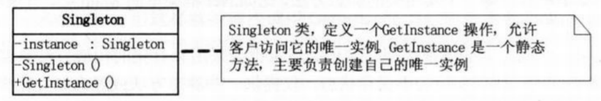

* 设计模式的六大原则

  * 开闭原则（Open Close Principle）

    开闭原则就是说对扩展开放，对修改关闭。在程序需要进行拓展的时候，不能去修改原有的代码，实现一个热插拔的效果。所以一句话概括就是：为了使程序的扩展性好，易于维护和升级。想要达到这样的效果，我们需要使用接口和抽象类，后面的具体设计中我们会提到这点。

  * 里氏代换原则（Liskov Substitution Principle）

    里氏代换原则(Liskov Substitution Principle LSP)面向对象设计的基本原则之一。 里氏代换原则中说，任何基类可以出现的地方，子类一定可以出现。 LSP 是继承复用的基石，只有当衍生类可以替换掉基类，软件单位的功能不受到影响时，基类才能真正被复用，而衍生类也能够在基类的基础上增加新的行为。里氏代换原则是对“开-闭”原则的补充。实现“开-闭”原则的关键步骤就是抽象化。而基类与子类的继承关系就是抽象化的具体实现，所以里氏代换原则是对实现抽象化的具体步骤的规范。—— From Baidu 百科

  * 依赖倒转原则（Dependence Inversion Principle）

    这个是开闭原则的基础，具体内容：针对接口编程，依赖于抽象而不依赖于具体。

  * 接口隔离原则（Interface Segregation Principle）

    这个原则的意思是：使用多个隔离的接口，比使用单个接口要好。还是一个降低类之间的耦合度的意思，从这儿我们看出，其实设计模式就是一个软件的设计思想，从大型软件架构出发，为了升级和维护方便。所以上文中多次出现：降低依赖，降低耦合。

  * 迪米特法则（最少知道原则）（Demeter Principle）

    为什么叫最少知道原则，就是说：一个实体应当尽量少的与其他实体之间发生相互作用，使得系统功能模块相对独立。

  * 合成复用原则（Composite Reuse Principle）

    原则是尽量使用合成/聚合的方式，而不是使用继承。

* 总体来说设计模式分为三大类：
  * 创建型模式，共五种：工厂方法模式、抽象工厂模式、单例模式、建造者模式、原型模式。

    * 单例模式（Singleton）：保证一个类只有一个实例，并提供一个访问它的全局访问点。

      * 单例设计模式的饿汉式、懒汉式、双重锁、静态内存写法

        ```java
        一、	饿汉式
        public class SingleTon {
        
         // 1.私有化构造方法，因为 private以后，每次new对象的时候都要调用构造方
        //法 而private的权限是当前类 那么其他类new对象的时候一定会失败
         private SingleTon() {}
        
         // 2.私有的静态的当前类属性
         private static SingleTon instance = new SingleTon();
        
         // 3.公共的获取当前类属性的方法
         public static SingleTon getInstance() {
         return instance;
         }
        }
        优点：不会出现第一次使用对象时，出现延迟的情况，响应速度快，线程安全。
        缺点：不管单例对象是否被使用，只要类一加载就创建，增加了内存的压力。
        二、	懒汉式
        public class SingleTon {
        
         // 1.私有构造方法
         private SingleTon() {}
         // 2.私有的静态的当前类类型的属性
         private volatile static SingleTon instance;
         // 3.公共的静态的获取当前类对象的方法
         public static SingleTon getInstance() {
         if(null == instance) {
         instance = new SingleTon();
         }
         return instance;
         }
        }
        优点：对象需要使用时才创建，减轻了内存的压力。
        缺点：第一次使用单例对象时，会出现一点延迟，线程非安全。
        三、	双重判断（懒汉式的升级版）
        public class SingleTon {
        
         // 1.私有构造方法
         private SingleTon() {}
         // 2.私有的静态的当前类类型的属性
         private static volatile SingleTon instance;
         // 3.公共的静态的获取当前类对象的方法
         public static SingleTon getInstance() {
         // 双重校验的目的在于提高方法的执行效率
         if(null == instance) {
         synchronized (SingleTon.class) {
         if(null == instance) {
         instance = new SingleTon();
         }
                    }
                }
         return instance;
         }
        }
        volatile关键字的作用：防止创建单例对象指令的重排序，创建对象可以分为三步步骤：①开辟一块堆内存空间②创建对象③将堆内存地址赋值给栈内存中的局部变量引用。所谓的指令重排序就是①②③的执行顺序会变成①③②，这就会出现单例对象还未创建，但是局部变量已经有引用了，这时局部变量进行后续操作都是错误的。
        两次判空则可以直接跳过锁，增加效率。
        优点：对象需要使用时，才创建，减轻了内存的压力，线程安全。
        缺点：第一次使用单例对象时，会出现一点延迟。
        四、静态内部类
        public class SingleTon {
        
         // 1.私有构造方法
         private SingleTon() {}
        
         // 2.静态内部类
         static class Inner {
         private static SingleTon instance = new SingleTon();
         }
        
         // 3.公共的静态的获取当前类对象的方法
         public static SingleTon getInstance() {
         return Inner.instance;
         }
        }
        外部类加载时并不需要立即加载内部类，JAVA虚拟机在有且仅有的5种场景下会对类进行初始化，除此之外的所有引用类都不会对类进行初始化，故而不占内存。只有当getInstance方法第一次被调用时，才会去初始化INSTANCE,第一次调用getInstance方法会导致虚拟机加载Inner类；虚拟机会保证一个类的<clinit>()方法在多线程环境中被正确地加锁、同步，如果多个线程同时去初始化一个类，那么只会有一个线程去执行这个类的<clinit>()方法，其他线程都需要阻塞等待，直到活动线程执行<clinit>()方法完毕。
        优点：内存压力小，线程安全，写法更加优雅。
        缺点：稍稍复杂。
        ```

    * 工厂方法模式（Factory Method）：定义一个用于创建对象的接口，让子类决定实例化哪一个类，Factory Method使一个类的实例化延迟到了子类。
      普通工厂模式→多个工厂方法模式→静态工厂方法模式

      工厂方法模式有一个问题就是，类的创建依赖工厂类，也就是说，如果想要拓展程序，必须对工厂类进行修改，这违背了闭包原则，所以，从设计角度考虑，有一定的问题，如何解决？
      就用到抽象工厂模式，创建多个工厂类，这样一旦需要增加新的功能，直接增加新的工厂类就可以了，不需要修改之前的代码。

      ```java
      普通工厂
      1. public interface Sender {
      2. public void Send();
      3. }
      
      1. public class MailSender implements Sender {
      2. @Override
      3. public void Send() {
      4. System.out.println("this is mailsender!");
      5. }
      6. }
      
      1. public class SmsSender implements Sender {
      2.
      3. @Override
      4. public void Send() {
      5. System.out.println("this is sms sender!");
      6. }
      7. }
      
      1. public class SendFactory {
      2.
      3. public Sender produce(String type) {4. if ("mail".equals(type)) {
      5. return new MailSender();
      6. } else if ("sms".equals(type)) {
      7. return new SmsSender();
      8. } else {
      9. System.out.println("请输入正确的类型!");
      10. return null;
      11. }
      12. }
      13. }
      
      1. public class FactoryTest {
      2.
      3. public static void main(String[] args) {
      4. SendFactory factory = new SendFactory();
      5. Sender sender = factory.produce("sms");
      6. sender.Send();
      7. }
      8. }
      
      多个工厂方法模式
      public class SendFactory {
      public Sender produceMail(){
      1. return new MailSender();
      2. }
      3.4. public Sender produceSms(){
      5. return new SmsSender();
      6. }
      7. }
      
      1. public class FactoryTest {
      2.
      3. public static void main(String[] args) {
      4. SendFactory factory = new SendFactory();
      5. Sender sender = factory.produceMail();
      6. sender.Send();
      7. }
      8. }
      
      静态工厂方法模式
      1. public class SendFactory {
      2.
      3. public static Sender produceMail(){
      4. return new MailSender();
      5. }
      6.
      7. public static Sender produceSms(){
      8. return new SmsSender();
      9. }
      10. }
      
      1. public class FactoryTest {
      2.
      3. public static void main(String[] args) {
      4. Sender sender = SendFactory.produceMail();
      5. sender.Send();
      6. }
      7. }
      ```
      
      
      
    * 抽象工厂模式（Abstract Factory）：提供一个创建一系列相关或相互依赖对象的接口，而无须指定它们的具体类。
  
      ```java
      抽象工厂模式
      1. public interface Sender {
      2. public void Send();
      3. }
      
      1. public class MailSender implements Sender {
      2. @Override
      3. public void Send() {
      4. System.out.println("this is mailsender!");
      5. }
      6. }
      
      1. public class SmsSender implements Sender {
      2.
      3. @Override
      4. public void Send() {
      5. System.out.println("this is sms sender!");
      6. }
      7. }
      
      1. public class SendMailFactory implements Provider {2.
      3. @Override
      4. public Sender produce(){
      5. return new MailSender();
      6. }
      7. }
      
      1. public class SendSmsFactory implements Provider{
      2.
      3. @Override
      4. public Sender produce() {
      5. return new SmsSender();
      6. }
      7. }
      
      1. public interface Provider {
      2. public Sender produce();
      3. }
      
      1. public class Test {
      2.
      3. public static void main(String[] args) {
      4. Provider provider = new SendMailFactory();
      5. Sender sender = provider.produce();
      6. sender.Send();
      7. }
      8. }
      ```
  
      
  
    * 建造者模式（Builder）：将一个复杂对象的构建与他的表示相分离，使得同样的构建过程可以创建不同的表示。
  
      ```java
      建造者模式
      1. public class Builder {
      2.
      3. private List<Sender> list = new ArrayList<Sender>();
      4.
      5. public void produceMailSender(int count){
      6. for(int i=0; i<count; i++){
      7. list.add(new MailSender());
      8. }
      9. }
      10.
      11. public void produceSmsSender(int count){
      12. for(int i=0; i<count; i++){
      13. list.add(new SmsSender());
      14. }
      15. }
      16. }
      
      1. public class Test {
      2.
      3. public static void main(String[] args) {
      4. Builder builder = new Builder();
      5. builder.produceMailSender(10);
      6. }
      7. }
      ```
  
      
  
    * 原型模式（Prototype）：用原型实例指定创建对象的种类，并且通过拷贝这些原型来创建新的对象。
  
      深复制和浅复制，要实现深复制，需要采用流的形式读入当前对象的二进制输入，再写出二进制数据对应的对象。
      
      ```java
      原型模式
      1. public class Prototype implements Cloneable {
      2.
      3. public Object clone() throws CloneNotSupportedException {
      4. Prototype proto = (Prototype) super.clone();
      5. return proto;
      6. }
      7. }
      
      1. public class Prototype implements Cloneable, Serializable {
      2.
      3. private static final long serialVersionUID = 1L;
      4. private String string;
      5.
      6. private SerializableObject obj;
      7.
      8. /* 浅复制 */
      9. public Object clone() throws CloneNotSupportedException {10. Prototype proto = (Prototype) super.clone();
      11. return proto;
      12. }
      13.
      14. /* 深复制 */
      15. public Object deepClone() throws IOException, ClassNotFoundException {
      16.
      17. /* 写入当前对象的二进制流 */
      18. ByteArrayOutputStream bos = new ByteArrayOutputStream();
      19. ObjectOutputStream oos = new ObjectOutputStream(bos);
      20. oos.writeObject(this);
      21.
      22. /* 读出二进制流产生的新对象 */
      23. ByteArrayInputStream bis = new ByteArrayInputStream(bos.toByteArray(
      ));
      24. ObjectInputStream ois = new ObjectInputStream(bis);
      25. return ois.readObject();
      26. }
      27.
      28. public String getString() {
      29. return string;
      30. }
      31.
      32. public void setString(String string) {
      33. this.string = string;
      34. }
      35.
      36. public SerializableObject getObj() {
      37. return obj;
      38. }
      39.
      40. public void setObj(SerializableObject obj) {
      41. this.obj = obj;
      42. }
      43.
      44. }
      45.
      46. class SerializableObject implements Serializable {
      47. private static final long serialVersionUID = 1L;
      48. }
      ```
      
      
  
  * 行为型模式，共十一种：策略模式、模板方法模式、观察者模式、迭代子模式、责任链模式、命令模式、备忘录模式、状态模式、访问者模式、中介者模式、解释器模式。
  
    * 迭代器模式（Iterator）：提供一个方法顺序访问一个聚合对象的各个元素，而又不需要暴露该对象的内部表示。
  
      ```java
      迭代子模式
      1. public interface Collection {
      2.
      3. public Iterator iterator();
      4.
      5. /*取得集合元素*/
      6. public Object get(int i);
      7.
      8. /*取得集合大小*/
      9. public int size();10. }
      
      1. public interface Iterator {
      2. //前移
      3. public Object previous();
      4.
      5. //后移
      6. public Object next();
      7. public boolean hasNext();
      8.
      9. //取得第一个元素
      10. public Object first();
      11. }
      
      1. public class MyCollection implements Collection {
      2.
      3. public String string[] = {"A","B","C","D","E"};
      4. @Override
      5. public Iterator iterator() {
      6. return new MyIterator(this);
      7. }
      8.
      9. @Override
      10. public Object get(int i) {
      11. return string[i];
      12. }
      13.
      14. @Override
      15. public int size() {
      16. return string.length;
      17. }
      18. }
      
      1. public class MyIterator implements Iterator {
      2.
      3. private Collection collection;
      4. private int pos = -1;
      5.
      6. public MyIterator(Collection collection){
      7. this.collection = collection;
      8. }
      9.
      10. @Override11. public Object previous() {
      12. if(pos > 0){
      13. pos--;
      14. }
      15. return collection.get(pos);
      16. }
      17.
      18. @Override
      19. public Object next() {
      20. if(pos<collection.size()-1){
      21. pos++;
      22. }
      23. return collection.get(pos);
      24. }
      25.
      26. @Override
      27. public boolean hasNext() {
      28. if(pos<collection.size()-1){
      29. return true;
      30. }else{
      31. return false;
      32. }
      33. }
      34.
      35. @Override
      36. public Object first() {
      37. pos = 0;
      38. return collection.get(pos);
      39. }
      40.
      41. }
      
      1. public class Test {
      2.
      3. public static void main(String[] args) {
      4. Collection collection = new MyCollection();
      5. Iterator it = collection.iterator();
      6.
      7. while(it.hasNext()){
      8. System.out.println(it.next());
      9. }
      10. }
      11. }
      ```
  
      
  
    * 观察者模式（Observer）：定义对象间一对多的依赖关系，当一个对象的状态发生改变时，所有依赖于它的对象都得到通知自动更新。
  
      ```java
      观察者模式
      1. public interface Observer {
      2. public void update();
      3. }
      
      1. public class Observer1 implements Observer {
      2.
      3. @Override
      4. public void update() {
      5. System.out.println("observer1 has received!");
      6. }
      7. }
      
      1. public class Observer2 implements Observer {
      2.
      3. @Override
      4. public void update() {
      5. System.out.println("observer2 has received!");
      6. }
      7.
      8. }
      
      1. public interface Subject {
      2.
      3. /*增加观察者*/
      4. public void add(Observer observer);
      5.
      6. /*删除观察者*/
      7. public void del(Observer observer);
      8.
      9. /*通知所有的观察者*/
      10. public void notifyObservers();
      11.
      12. /*自身的操作*/
      13. public void operation();
      14. }
      
      1. public abstract class AbstractSubject implements Subject {2.
      3. private Vector<Observer> vector = new Vector<Observer>();
      4. @Override
      5. public void add(Observer observer) {
      6. vector.add(observer);
      7. }
      8.
      9. @Override
      10. public void del(Observer observer) {
      11. vector.remove(observer);
      12. }
      13.
      14. @Override
      15. public void notifyObservers() {
      16. Enumeration<Observer> enumo = vector.elements();
      17. while(enumo.hasMoreElements()){
      18. enumo.nextElement().update();
      19. }
      20. }
      21. }
      
      1. public class MySubject extends AbstractSubject {
      2.
      3. @Override
      4. public void operation() {
      5. System.out.println("update self!");
      6. notifyObservers();
      7. }
      8.
      9. }
      
      1. public class ObserverTest {
      2.
      3. public static void main(String[] args) {
      4. Subject sub = new MySubject();
      5. sub.add(new Observer1());
      6. sub.add(new Observer2());
      7.
      8. sub.operation();
      9. }
      10.
      11. }
      ```
  
      
  
    * 模板方法模式（Template Method）：定义一个操作中的算法的骨架，而将一些步骤延迟到子类中，TemplateMethod使得子类可以不改变一个算法的结构即可以重定义该算法得某些特定步骤。
  
      ```java
      模板方法模式
      1. public abstract class AbstractCalculator {
      2.
      3. /*主方法，实现对本类其它方法的调用*/
      4. public final int calculate(String exp,String opt){
      5. int array[] = split(exp,opt);
      6. return calculate(array[0],array[1]);
      7. }
      8.
      9. /*被子类重写的方法*/
      10. abstract public int calculate(int num1,int num2);
      11.
      12. public int[] split(String exp,String opt){
      13. String array[] = exp.split(opt);
      14. int arrayInt[] = new int[2];
      15. arrayInt[0] = Integer.parseInt(array[0]);
      16. arrayInt[1] = Integer.parseInt(array[1]);
      17. return arrayInt;
      18. }
      19. }
      
      1. public class Plus extends AbstractCalculator {
      2.
      3. @Override
      4. public int calculate(int num1,int num2) {
      5. return num1 + num2;
      6. }
      7. }
      
      1. public class StrategyTest {
      2.
      3. public static void main(String[] args) {
      4. String exp = "8+8";
      5. AbstractCalculator cal = new Plus();
      6. int result = cal.calculate(exp, "\\+");
      7. System.out.println(result);
      8. }
      9. }
      ```
  
      
  
    * 命令模式（Command）：将一个请求封装为一个对象，从而使你可以用不同的请求对客户进行参数化，对请求排队和记录请求日志，以及支持可撤销的操作。
  
      ```java
      命令模式
      1. public interface Command {
      2. public void exe();
      3. }
      
      1. public class MyCommand implements Command {
      2.
      3. private Receiver receiver;
      4.
      5. public MyCommand(Receiver receiver) {
      6. this.receiver = receiver;
      7. }
      8.
      9. @Override
      10. public void exe() {
      11. receiver.action();
      12. }
      13. }
      
      1. public class Receiver {
      2. public void action(){
      3. System.out.println("command received!");
      4. }
      5. }
      
      1. public class Invoker {
      2.
      3. private Command command;
      4.
      5. public Invoker(Command command) {
      6. this.command = command;
      7. }
      8.
      9. public void action(){
      10. command.exe();
      11. }
      12. }
      
      1. public class Test {
      2.
      3. public static void main(String[] args) {
      4. Receiver receiver = new Receiver();
      5. Command cmd = new MyCommand(receiver);
      6. Invoker invoker = new Invoker(cmd);
      7. invoker.action();
      8. }
      9. }
      ```
  
      
  
    * 状态模式（State）：允许对象在其内部状态改变时改变他的行为。对象看起来似乎改变了他的类。
  
      ```java
      状态模式
      1. package com.xtfggef.dp.state;
      2.
      3. /**
      4. * 状态类的核心类
      5. * 2012-12-1
      6. * @author erqing
      7. *
      8. */
      9. public class State {
      10.
      11. private String value;
      12.
      13. public String getValue() {
      14. return value;
      15. }
      16.
      17. public void setValue(String value) {
      18. this.value = value;
      19. }
      20.
      21. public void method1(){
      22. System.out.println("execute the first opt!");
      23. }
      24.
      25. public void method2(){
      26. System.out.println("execute the second opt!");
      27. }
      28. }
      
      1. package com.xtfggef.dp.state;
      2.
      3. /**
      4. * 状态模式的切换类 2012-12-1
      5. * @author erqing
      6. *
      7. */
      8. public class Context {
      9.
      10. private State state;
      11.
      12. public Context(State state) {
      13. this.state = state;
      14. }
      15.
      16. public State getState() {
      17. return state;
      18. }
      19.
      20. public void setState(State state) {
      21. this.state = state;
      22. }
      23.
      24. public void method() {
      25. if (state.getValue().equals("state1")) {
      26. state.method1();
      27. } else if (state.getValue().equals("state2")) {
      28. state.method2();
      29. }
      30. }
      31. }
      
      1. public class Test {
      2.
      3. public static void main(String[] args) {
      4.
      5. State state = new State();
      6. Context context = new Context(state);
      7.
      8. //设置第一种状态
      9. state.setValue("state1");10. context.method();
      11.
      12. //设置第二种状态
      13. state.setValue("state2");
      14. context.method();
      15. }
      16. }
      ```
  
      
  
    * 策略模式（strategy）：定义一系列的算法，把他们一个个封装起来，并使他们可以互相替换，本模式使得算法可以独立于使用它们的客户。
  
      ```java
      策略模式
      1. public interface ICalculator {
      2. public int calculate(String exp);
      3. }
      
      1. public abstract class AbstractCalculator {
      2.
      3. public int[] split(String exp,String opt){
      4. String array[] = exp.split(opt);
      5. int arrayInt[] = new int[2];
      6. arrayInt[0] = Integer.parseInt(array[0]);
      7. arrayInt[1] = Integer.parseInt(array[1]);
      8. return arrayInt;
      9. }
      10. }
      
      1. public class Plus extends AbstractCalculator implements ICalculator {
      2.
      3. @Override
      4. public int calculate(String exp) {
      5. int arrayInt[] = split(exp,"\\+");
      6. return arrayInt[0]+arrayInt[1];
      7. }
      8. }
      
      1. public class Minus extends AbstractCalculator implements ICalculator {
      2.
      3. @Override
      4. public int calculate(String exp) {
      5. int arrayInt[] = split(exp,"-");
      6. return arrayInt[0]-arrayInt[1];
      7. }
      8.
      9. }
      
      1. public class Multiply extends AbstractCalculator implements ICalculator {
      2.
      3. @Override
      4. public int calculate(String exp) {
      5. int arrayInt[] = split(exp,"\\*");
      6. return arrayInt[0]*arrayInt[1];
      7. }
      8. }
      
      1. public class StrategyTest {
      2.
      3. public static void main(String[] args) {
      4. String exp = "2+8";
      5. ICalculator cal = new Plus();
      6. int result = cal.calculate(exp);
      7. System.out.println(result);
      8. }
      9. }
      ```
  
      
  
    * 责任链模式（Chain of Responsibility）：使多个对象都有机会处理请求，从而避免请求的送发者和接收者之间的耦合关系。
  
      ```java
      责任链模式
      1. public interface Handler {
      2. public void operator();
      3. }
      
      1. public abstract class AbstractHandler {
      2.
      3. private Handler handler;
      4.
      5. public Handler getHandler() {
      6. return handler;
      7. }
      8.
      9. public void setHandler(Handler handler) {10. this.handler = handler;
      11. }
      12.
      13. }
      
      1. public class MyHandler extends AbstractHandler implements Handler {
      2.
      3. private String name;
      4.
      5. public MyHandler(String name) {
      6. this.name = name;
      7. }
      8.
      9. @Override
      10. public void operator() {
      11. System.out.println(name+"deal!");
      12. if(getHandler()!=null){
      13. getHandler().operator();
      14. }
      15. }
      16. }
      
      1. public class Test {
      2.
      3. public static void main(String[] args) {
      4. MyHandler h1 = new MyHandler("h1");
      5. MyHandler h2 = new MyHandler("h2");
      6. MyHandler h3 = new MyHandler("h3");
      7.
      8. h1.setHandler(h2);
      9. h2.setHandler(h3);
      10.
      11. h1.operator();
      12. }
      13. }
      ```
  
      
  
    * 中介者模式（Mediator）：用一个中介对象封装一些列的对象交互。
  
      ```java
      中介者模式
      1. public interface Mediator {
      2. public void createMediator();
      3. public void workAll();
      4. }
      
      1. public class MyMediator implements Mediator {
      2.
      3. private User user1;
      4. private User user2;
      5.
      6. public User getUser1() {
      7. return user1;
      8. }
      9.
      10. public User getUser2() {
      11. return user2;
      12. }
      13.
      14. @Override
      15. public void createMediator() {
      16. user1 = new User1(this);
      17. user2 = new User2(this);
      18. }
      19.
      20. @Override
      21. public void workAll() {
      22. user1.work();
      23. user2.work();
      24. }
      25. }
      
      1. public abstract class User {
      2.
      3. private Mediator mediator;
      4.
      5. public Mediator getMediator(){
      6. return mediator;
      7. }8.
      9. public User(Mediator mediator) {
      10. this.mediator = mediator;
      11. }
      12.
      13. public abstract void work();
      14. }
      
      1. public class User1 extends User {
      2.
      3. public User1(Mediator mediator){
      4. super(mediator);
      5. }
      6.
      7. @Override
      8. public void work() {
      9. System.out.println("user1 exe!");
      10. }
      11. }
      
      1. public class User2 extends User {
      2.
      3. public User2(Mediator mediator){
      4. super(mediator);
      5. }
      6.
      7. @Override
      8. public void work() {
      9. System.out.println("user2 exe!");
      10. }
      11. }
      
      1. public class Test {2.
      3. public static void main(String[] args) {
      4. Mediator mediator = new MyMediator();
      5. mediator.createMediator();
      6. mediator.workAll();
      7. }
      8. }
      ```
  
      
  
    * 访问者模式（Visitor）：表示一个作用于某对象结构中的各元素的操作，它使你可以在不改变各元素类的前提下定义作用于这个元素的新操作。
  
      ```java
      访问者模式
      1. public interface Visitor {
      2. public void visit(Subject sub);
      3. }
      
      1. public class MyVisitor implements Visitor {
      2.
      3. @Override
      4. public void visit(Subject sub) {
      5. System.out.println("visit the subject： "+sub.getSubject());
      6. }
      7. }
      
      1. public interface Subject {
      2. public void accept(Visitor visitor);
      3. public String getSubject();
      4. }
      
      1. public class MySubject implements Subject {
      2.
      3. @Override
      4. public void accept(Visitor visitor) {
      5. visitor.visit(this);
      6. }
      7.
      8. @Override
      9. public String getSubject() {
      10. return "love";
      11. }
      12. }
      
      1. public class Test {
      2.
      3. public static void main(String[] args) {
      4.
      5. Visitor visitor = new MyVisitor();6. Subject sub = new MySubject();
      7. sub.accept(visitor);
      8. }
      9. }
      ```
  
      
  
    * 解释器模式（Interpreter）：给定一个语言，定义他的文法的一个表示，并定义一个解释器，这个解释器使用该表示来解释语言中的句子。
  
      ```java
      解释器模式
      1. public interface Expression {
      2. public int interpret(Context context);
      3. }
      
      1. public class Plus implements Expression {
      2.
      3. @Override
      4. public int interpret(Context context) {
      5. return context.getNum1()+context.getNum2();
      6. }
      7. }
      
      1. public class Minus implements Expression {
      2.
      3. @Override
      4. public int interpret(Context context) {
      5. return context.getNum1()-context.getNum2();
      6. }
      7. }
      
      1. public class Context {
      2.
      3. private int num1;
      4. private int num2;
      5.
      6. public Context(int num1, int num2) {
      7. this.num1 = num1;
      8. this.num2 = num2;
      9. }
      10.
      11. public int getNum1() {
      12. return num1;
      13. }
      14. public void setNum1(int num1) {
      15. this.num1 = num1;
      16. }
      17. public int getNum2() {
      18. return num2;
      19. }
      20. public void setNum2(int num2) {
      21. this.num2 = num2;
      22. }
      23.
      24.
      25. }
      
      1. public class Test {2.
      3. public static void main(String[] args) {
      4.
      5. // 计算 9+2-8 的值
      6. int result = new Minus().interpret((new Context(new Plus()
      7. .interpret(new Context(9, 2)), 8)));
      8. System.out.println(result);
      9. }
      10. }
      ```
  
      
  
    * 备忘录模式（Memento）：在不破坏对象的前提下，捕获一个对象的内部状态，并在该对象之外保存这个状态。
  
      ```java
      备忘录模式
      1. public class Original {
      2.
      3. private String value;
      4.5. public String getValue() {
      6. return value;
      7. }
      8.
      9. public void setValue(String value) {
      10. this.value = value;
      11. }
      12.
      13. public Original(String value) {
      14. this.value = value;
      15. }
      16.
      17. public Memento createMemento(){
      18. return new Memento(value);
      19. }
      20.
      21. public void restoreMemento(Memento memento){
      22. this.value = memento.getValue();
      23. }
      24. }
      
      1. public class Memento {
      2.
      3. private String value;
      4.
      5. public Memento(String value) {
      6. this.value = value;
      7. }
      8.
      9. public String getValue() {
      10. return value;
      11. }
      12.
      13. public void setValue(String value) {
      14. this.value = value;
      15. }
      16. }
      
      1. public class Storage {
      2.
      3. private Memento memento;
      4.
      5. public Storage(Memento memento) {
      6. this.memento = memento;7. }
      8.
      9. public Memento getMemento() {
      10. return memento;
      11. }
      12.
      13. public void setMemento(Memento memento) {
      14. this.memento = memento;
      15. }
      16. }
      
      1. public class Test {
      2.
      3. public static void main(String[] args) {
      4.
      5. // 创建原始类
      6. Original origi = new Original("egg");
      7.
      8. // 创建备忘录
      9. Storage storage = new Storage(origi.createMemento());
      10.
      11. // 修改原始类的状态
      12. System.out.println("初始化状态为： " + origi.getValue());
      13. origi.setValue("niu");
      14. System.out.println("修改后的状态为： " + origi.getValue());
      15.
      16. // 回复原始类的状态
      17. origi.restoreMemento(storage.getMemento());
      18. System.out.println("恢复后的状态为： " + origi.getValue());
      19. }
      20. }
      ```
  
      
  
  * 结构型模式，共七种：适配器模式、装饰器模式、代理模式、外观模式、桥接模式、组合模式、享元模式。
  
    * 组合模式（Composite）：将对象组合成树形结构以表示部分整体的关系，Composite使得用户对单个对象和组合对象的使用具有一致性。
    
      ```java
      组合模式
      1. public class TreeNode {
      2.
      3. private String name;
      4. private TreeNode parent;
      5. private Vector<TreeNode> children = new Vector<TreeNode>();
      6.
      7. public TreeNode(String name){
      8. this.name = name;
      9. }
      10.
      11. public String getName() {
      12. return name;
      13. }
      14.
      15. public void setName(String name) {
      16. this.name = name;
      17. }
      18.
      19. public TreeNode getParent() {
      20. return parent;
      21. }22.
      23. public void setParent(TreeNode parent) {
      24. this.parent = parent;
      25. }
      26.
      27. //添加孩子节点
      28. public void add(TreeNode node){
      29. children.add(node);
      30. }
      31.
      32. //删除孩子节点
      33. public void remove(TreeNode node){
      34. children.remove(node);
      35. }
      36.
      37. //取得孩子节点
      38. public Enumeration<TreeNode> getChildren(){
      39. return children.elements();
      40. }
      41. }
      
      1. public class Tree {
      2.
      3. TreeNode root = null;
      4.
      5. public Tree(String name) {
      6. root = new TreeNode(name);
      7. }
      8.
      9. public static void main(String[] args) {
      10. Tree tree = new Tree("A");
      11. TreeNode nodeB = new TreeNode("B");
      12. TreeNode nodeC = new TreeNode("C");
      13.
      14. nodeB.add(nodeC);
      15. tree.root.add(nodeB);
      16. System.out.println("build the tree finished!");
      17. }
      18. }
      ```
    
      
    
    * 外观模式（Facade）：为子系统中的一组接口提供一致的界面，facade提供了一高层接口，这个接口使得子系统更容易使用。
    
      ```java
      外观模式
      1. public class CPU {
      2.
      3. public void startup(){
      4. System.out.println("cpu startup!");
      5. }
      6.
      7. public void shutdown(){
      8. System.out.println("cpu shutdown!");
      9. }
      10. }
      
      1. public class Memory {
      2.
      3. public void startup(){
      4. System.out.println("memory startup!");
      5. }6.
      7. public void shutdown(){
      8. System.out.println("memory shutdown!");
      9. }
      10. }
      
      1. public class Disk {
      2.
      3. public void startup(){
      4. System.out.println("disk startup!");
      5. }
      6.
      7. public void shutdown(){
      8. System.out.println("disk shutdown!");
      9. }
      10. }
      
      1. public class Computer {
      2. private CPU cpu;
      3. private Memory memory;
      4. private Disk disk;
      5.
      6. public Computer(){
      7. cpu = new CPU();
      8. memory = new Memory();
      9. disk = new Disk();
      10. }
      11.
      12. public void startup(){
      13. System.out.println("start the computer!");
      14. cpu.startup();
      15. memory.startup();
      16. disk.startup();
      17. System.out.println("start computer finished!");
      18. }
      19.
      20. public void shutdown(){
      21. System.out.println("begin to close the computer!");
      22. cpu.shutdown();
      23. memory.shutdown();
      24. disk.shutdown();
      25. System.out.println("computer closed!");
      26. }
      27. }
      
      1. public class User {
      2.
      3. public static void main(String[] args) {
      4. Computer computer = new Computer();
      5. computer.startup();
      6. computer.shutdown();
      7. }
      8. }
      ```
    
      
    
    * 代理模式（Proxy）：为其他对象提供一种代理以控制对这个对象的访问
    
      ```java
      代理模式
      1. public interface Sourceable {
      2. public void method();
      3. }
      
      1. public class Source implements Sourceable {
      2.
      3. @Override
      4. public void method() {
      5. System.out.println("the original method!");
      6. }
      7. }
      
      1. public class Proxy implements Sourceable {
      2.
      3. private Source source;
      4. public Proxy(){
      5. super();
      6. this.source = new Source();
      7. }
      8. @Override
      9. public void method() {
      10. before();
      11. source.method();
      12. atfer();
      13. }
      14. private void atfer() {
      15. System.out.println("after proxy!");
      16. }
      17. private void before() {
      18. System.out.println("before proxy!");
      19. }
      20. }
      
      1. public class ProxyTest {
      2.
      3. public static void main(String[] args) {
      4. Sourceable source = new Proxy();
      5. source.method();
      6. }
      7.
      8. }
      ```
    
      
    
    * 适配器模式（Adapter）：将一类的接口转换成客户希望的另外一个接口，Adapter模式使得原本由于接口不兼容而不能一起工作那些类可以一起工作。
    
      ```java
      类的适配器模式
      1. public class Source {
      2.
      3. public void method1() {
      4. System.out.println("this is original method!");
      5. }
      6. }
      
      1. public interface Targetable {
      2.
      3. /* 与原类中的方法相同 */
      4. public void method1();
      5.
      6. /* 新类的方法 */
      7. public void method2();
      8. }
      
      1. public class Adapter extends Source implements Targetable {
      2.
      3. @Override
      4. public void method2() {
      5. System.out.println("this is the targetable method!");
      6. }
      7. }
      
      1. public class AdapterTest {
      2.
      3. public static void main(String[] args) {
      4. Targetable target = new Adapter();
      5. target.method1();
      6. target.method2();
      7. }
      8. }
      
      对象的适配器模式
      1. public class Wrapper implements Targetable {
      2.
      3. private Source source;
      4.
      5. public Wrapper(Source source){
      6. super();
      7. this.source = source;
      8. }
      9. @Override
      10. public void method2() {
      11. System.out.println("this is the targetable method!");
      12. }
      13.
      14. @Override
      15. public void method1() {
      16. source.method1();
      17. }
      18. }
      
      1. public class AdapterTest {
      2.
      3. public static void main(String[] args) {
      4. Source source = new Source();5. Targetable target = new Wrapper(source);
      6. target.method1();
      7. target.method2();
      8. }
      9. }
      
      接口的适配器模式
      1. public interface Sourceable {
      2.
      3. public void method1();
      4. public void method2();
      5. }
      
      1. public abstract class Wrapper2 implements Sourceable{
      2.
      3. public void method1(){}
      4. public void method2(){}
      5. }
      
      1. public class SourceSub1 extends Wrapper2 {
      2. public void method1(){
      3. System.out.println("the sourceable interface's first Sub1!");
      4. }
      5. }
      
      1. public class SourceSub2 extends Wrapper2 {
      2. public void method2(){
      3. System.out.println("the sourceable interface's second Sub2!");
      4. }
      5. }
      
      1. public class WrapperTest {
      2.
      3. public static void main(String[] args) {
      4. Sourceable source1 = new SourceSub1();
      5. Sourceable source2 = new SourceSub2();
      6.
      7. source1.method1();
      8. source1.method2();
      9. source2.method1();
      10. source2.method2();
      11. }
      12. }
      ```
    
      
    
    * 装饰模式（Decorator）：动态地给一个对象增加一些额外的职责，就增加的功能来说，Decorator模式相比生成子类更加灵活。
    
      ```java
      装饰模式
      1. public interface Sourceable {
      2. public void method();
      3. }
      
      1. public class Source implements Sourceable {
      2.
      3. @Override
      4. public void method() {
      5. System.out.println("the original method!");
      6. }
      7. }
      
      1. public class Decorator implements Sourceable {
      2.
      3. private Sourceable source;
      4.
      5. public Decorator(Sourceable source){
      6. super();
      7. this.source = source;
      8. }
      9. @Override
      10. public void method() {
      11. System.out.println("before decorator!");
      12. source.method();
      13. System.out.println("after decorator!");
      14. }
      15. }
      
      1. public class DecoratorTest {2.
      3. public static void main(String[] args) {
      4. Sourceable source = new Source();
      5. Sourceable obj = new Decorator(source);
      6. obj.method();
      7. }
      8. }
      ```
    
      
    
    * 桥接模式（Bridge）：将抽象部分与它的实现部分相分离，使他们可以独立的变化。
    
      ```java
      桥接模式
      1. public interface Sourceable {
      2. public void method();
      3. }
      
      1. public class SourceSub1 implements Sourceable {
      2.
      3. @Override
      4. public void method() {
      5. System.out.println("this is the first sub!");
      6. }
      7. }
      
      1. public class SourceSub2 implements Sourceable {
      2.
      3. @Override
      4. public void method() {
      5. System.out.println("this is the second sub!");
      6. }
      7. }
      
      1. public abstract class Bridge {
      2. private Sourceable source;
      3.
      4. public void method(){
      5. source.method();
      6. }7.
      8. public Sourceable getSource() {
      9. return source;
      10. }
      11.
      12. public void setSource(Sourceable source) {
      13. this.source = source;
      14. }
      15. }
      
      1. public class MyBridge extends Bridge {
      2. public void method(){
      3. getSource().method();
      4. }
      5. }
      
      1. public class BridgeTest {
      2.
      3. public static void main(String[] args) {
      4.
      5. Bridge bridge = new MyBridge();
      6.
      7. /*调用第一个对象*/
      8. Sourceable source1 = new SourceSub1();
      9. bridge.setSource(source1);
      10. bridge.method();
      11.
      12. /*调用第二个对象*/
      13. Sourceable source2 = new SourceSub2();
      14. bridge.setSource(source2);
      15. bridge.method();
      16. }
      17. }
      ```
    
      
    
    * 享元模式（Flyweight）
    
      ```java
      享元模式
      1. public class ConnectionPool {
      2.
      3. private Vector<Connection> pool;
      4.
      5. /*公有属性*/
      6. private String url = "jdbc:mysql://localhost:3306/test";
      7. private String username = "root";
      8. private String password = "root";
      9. private String driverClassName = "com.mysql.jdbc.Driver";
      10.
      11. private int poolSize = 100;
      12. private static ConnectionPool instance = null;13. Connection conn = null;
      14.
      15. /*构造方法，做一些初始化工作*/
      16. private ConnectionPool() {
      17. pool = new Vector<Connection>(poolSize);
      18.
      19. for (int i = 0; i < poolSize; i++) {
      20. try {
      21. Class.forName(driverClassName);
      22. conn = DriverManager.getConnection(url, username, password);
      23. pool.add(conn);
      24. } catch (ClassNotFoundException e) {
      25. e.printStackTrace();
      26. } catch (SQLException e) {
      27. e.printStackTrace();
      28. }
      29. }
      30. }
      31.
      32. /* 返回连接到连接池 */
      33. public synchronized void release() {
      34. pool.add(conn);
      35. }
      36.
      37. /* 返回连接池中的一个数据库连接 */
      38. public synchronized Connection getConnection() {
      39. if (pool.size() > 0) {
      40. Connection conn = pool.get(0);
      41. pool.remove(conn);
      42. return conn;
      43. } else {
      44. return null;
      45. }
      46. }
      47. }
      ```
    
      
    
    * 其实还有两类：并发型模式和线程池模式。用一个图片来整体描述一下：