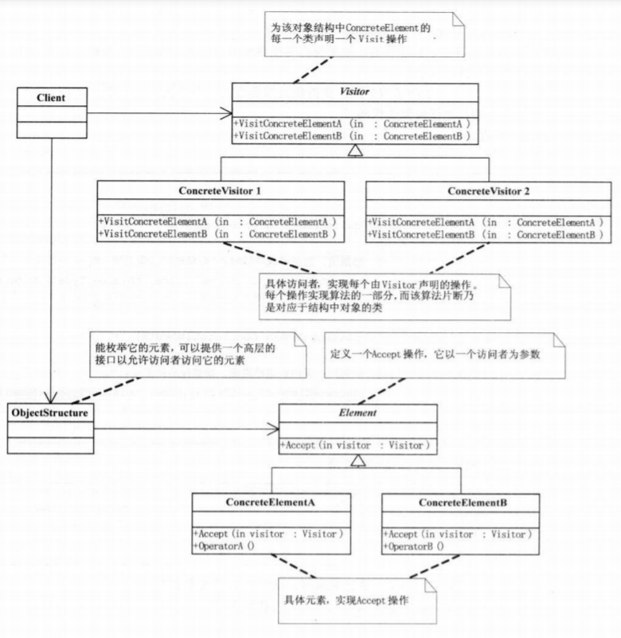

* 设计模式的六大原则

  * 开闭原则（Open Close Principle）

    开闭原则就是说对扩展开放，对修改关闭。在程序需要进行拓展的时候，不能去修改原有的代码，实现一个热插拔的效果。所以一句话概括就是：为了使程序的扩展性好，易于维护和升级。想要达到这样的效果，我们需要使用接口和抽象类，后面的具体设计中我们会提到这点。

  * 里氏代换原则（Liskov Substitution Principle）

    里氏代换原则(Liskov Substitution Principle LSP)面向对象设计的基本原则之一。 里氏代换原则中说，任何基类可以出现的地方，子类一定可以出现。 LSP 是继承复用的基石，只有当衍生类可以替换掉基类，软件单位的功能不受到影响时，基类才能真正被复用，而衍生类也能够在基类的基础上增加新的行为。里氏代换原则是对“开-闭”原则的补充。实现“开-闭”原则的关键步骤就是抽象化。而基类与子类的继承关系就是抽象化的具体实现，所以里氏代换原则是对实现抽象化的具体步骤的规范。—— From Baidu 百科

  * 依赖倒转原则（Dependence Inversion Principle）

    这个是开闭原则的基础，具体内容：针对接口编程，依赖于抽象而不依赖于具体。

  * 接口隔离原则（Interface Segregation Principle）

    这个原则的意思是：使用多个隔离的接口，比使用单个接口要好。还是一个降低类之间的耦合度的意思，从这儿我们看出，其实设计模式就是一个软件的设计思想，从大型软件架构出发，为了升级和维护方便。所以上文中多次出现：降低依赖，降低耦合。

  * 迪米特法则（最少知道原则）（Demeter Principle）

    为什么叫最少知道原则，就是说：一个实体应当尽量少的与其他实体之间发生相互作用，使得系统功能模块相对独立。

  * 合成复用原则（Composite Reuse Principle）

    原则是尽量使用合成/聚合的方式，而不是使用继承。

* 总体来说设计模式分为三大类：
  * 创建型模式，共五种：工厂方法模式、抽象工厂模式、单例模式、建造者模式、原型模式。

    * 单例模式（Singleton）：保证一个类只有一个实例，并提供一个访问它的全局访问点。

      * 单例设计模式的饿汉式、懒汉式、双重锁、静态内存写法

        ```java
        一、	饿汉式
        public class SingleTon {
        
         // 1.私有化构造方法，因为 private以后，每次new对象的时候都要调用构造方
        //法 而private的权限是当前类 那么其他类new对象的时候一定会失败
         private SingleTon() {}
        
         // 2.私有的静态的当前类属性
         private static SingleTon instance = new SingleTon();
        
         // 3.公共的获取当前类属性的方法
         public static SingleTon getInstance() {
         return instance;
         }
        }
        优点：不会出现第一次使用对象时，出现延迟的情况，响应速度快，线程安全。
        缺点：不管单例对象是否被使用，只要类一加载就创建，增加了内存的压力。
        二、	懒汉式
        public class SingleTon {
        
         // 1.私有构造方法
         private SingleTon() {}
         // 2.私有的静态的当前类类型的属性
         private volatile static SingleTon instance;
         // 3.公共的静态的获取当前类对象的方法
         public static SingleTon getInstance() {
         if(null == instance) {
         instance = new SingleTon();
         }
         return instance;
         }
        }
        优点：对象需要使用时才创建，减轻了内存的压力。
        缺点：第一次使用单例对象时，会出现一点延迟，线程非安全。
        三、	双重判断（懒汉式的升级版）
        public class SingleTon {
        
         // 1.私有构造方法
         private SingleTon() {}
         // 2.私有的静态的当前类类型的属性
         private static volatile SingleTon instance;
         // 3.公共的静态的获取当前类对象的方法
         public static SingleTon getInstance() {
         // 双重校验的目的在于提高方法的执行效率
         if(null == instance) {
         synchronized (SingleTon.class) {
         if(null == instance) {
         instance = new SingleTon();
         }
                    }
                }
         return instance;
         }
        }
        volatile关键字的作用：防止创建单例对象指令的重排序，创建对象可以分为三步步骤：①开辟一块堆内存空间②创建对象③将堆内存地址赋值给栈内存中的局部变量引用。所谓的指令重排序就是①②③的执行顺序会变成①③②，这就会出现单例对象还未创建，但是局部变量已经有引用了，这时局部变量进行后续操作都是错误的。
        两次判空则可以直接跳过锁，增加效率。
        优点：对象需要使用时，才创建，减轻了内存的压力，线程安全。
        缺点：第一次使用单例对象时，会出现一点延迟。
        四、静态内部类
        public class SingleTon {
        
         // 1.私有构造方法
         private SingleTon() {}
        
         // 2.静态内部类
         static class Inner {
         private static SingleTon instance = new SingleTon();
         }
        
         // 3.公共的静态的获取当前类对象的方法
         public static SingleTon getInstance() {
         return Inner.instance;
         }
        }
        外部类加载时并不需要立即加载内部类，JAVA虚拟机在有且仅有的5种场景下会对类进行初始化，除此之外的所有引用类都不会对类进行初始化，故而不占内存。只有当getInstance方法第一次被调用时，才会去初始化INSTANCE,第一次调用getInstance方法会导致虚拟机加载Inner类；虚拟机会保证一个类的<clinit>()方法在多线程环境中被正确地加锁、同步，如果多个线程同时去初始化一个类，那么只会有一个线程去执行这个类的<clinit>()方法，其他线程都需要阻塞等待，直到活动线程执行<clinit>()方法完毕。
        优点：内存压力小，线程安全，写法更加优雅。
        缺点：稍稍复杂。
        ```

    * 工厂方法模式（Factory Method）：定义一个用于创建对象的接口，让子类决定实例化哪一个类，Factory Method使一个类的实例化延迟到了子类。
      普通工厂模式→多个工厂方法模式→静态工厂方法模式

      工厂方法模式有一个问题就是，类的创建依赖工厂类，也就是说，如果想要拓展程序，必须对工厂类进行修改，这违背了闭包原则，所以，从设计角度考虑，有一定的问题，如何解决？
      就用到抽象工厂模式，创建多个工厂类，这样一旦需要增加新的功能，直接增加新的工厂类就可以了，不需要修改之前的代码。

    * 抽象工厂模式（Abstract Factory）：提供一个创建一系列相关或相互依赖对象的接口，而无须指定它们的具体类。

    * 建造者模式（Builder）：将一个复杂对象的构建与他的表示相分离，使得同样的构建过程可以创建不同的表示。

    * 原型模式（Prototype）：用原型实例指定创建对象的种类，并且通过拷贝这些原型来创建新的对象。

      深复制和浅复制，要实现深复制，需要采用流的形式读入当前对象的二进制输入，再写出二进制数据对应的对象。

  * 行为型模式，共十一种：策略模式、模板方法模式、观察者模式、迭代子模式、责任链模式、命令模式、备忘录模式、状态模式、访问者模式、中介者模式、解释器模式。

    * 迭代器模式（Iterator）：提供一个方法顺序访问一个聚合对象的各个元素，而又不需要暴露该对象的内部表示。
    * 观察者模式（Observer）：定义对象间一对多的依赖关系，当一个对象的状态发生改变时，所有依赖于它的对象都得到通知自动更新。
    * 模板方法模式（Template Method）：定义一个操作中的算法的骨架，而将一些步骤延迟到子类中，TemplateMethod使得子类可以不改变一个算法的结构即可以重定义该算法得某些特定步骤。
    * 命令模式（Command）：将一个请求封装为一个对象，从而使你可以用不同的请求对客户进行参数化，对请求排队和记录请求日志，以及支持可撤销的操作。
    * 状态模式（State）：允许对象在其内部状态改变时改变他的行为。对象看起来似乎改变了他的类。
    * 策略模式（strategy）：定义一系列的算法，把他们一个个封装起来，并使他们可以互相替换，本模式使得算法可以独立于使用它们的客户。
    * 责任链模式（Chain of Responsibility）：使多个对象都有机会处理请求，从而避免请求的送发者和接收者之间的耦合关系。
    * 中介者模式（Mediator）：用一个中介对象封装一些列的对象交互。
    * 访问者模式（Visitor）：表示一个作用于某对象结构中的各元素的操作，它使你可以在不改变各元素类的前提下定义作用于这个元素的新操作。
    * 解释器模式（Interpreter）：给定一个语言，定义他的文法的一个表示，并定义一个解释器，这个解释器使用该表示来解释语言中的句子。
    * 备忘录模式（Memento）：在不破坏对象的前提下，捕获一个对象的内部状态，并在该对象之外保存这个状态。

  * 结构型模式，共七种：适配器模式、装饰器模式、代理模式、外观模式、桥接模式、组合模式、享元模式。

    * 组合模式（Composite）：将对象组合成树形结构以表示部分整体的关系，Composite使得用户对单个对象和组合对象的使用具有一致性。
    * 外观模式（Facade）：为子系统中的一组接口提供一致的界面，facade提供了一高层接口，这个接口使得子系统更容易使用。
    * 代理模式（Proxy）：为其他对象提供一种代理以控制对这个对象的访问
    * 适配器模式（Adapter）：将一类的接口转换成客户希望的另外一个接口，Adapter模式使得原本由于接口不兼容而不能一起工作那些类可以一起工作。
    * 装饰模式（Decorator）：动态地给一个对象增加一些额外的职责，就增加的功能来说，Decorator模式相比生成子类更加灵活。
    * 桥接模式（Bridge）：将抽象部分与它的实现部分相分离，使他们可以独立的变化。
    * 享元模式（Flyweight）
    * 其实还有两类：并发型模式和线程池模式。用一个图片来整体描述一下：